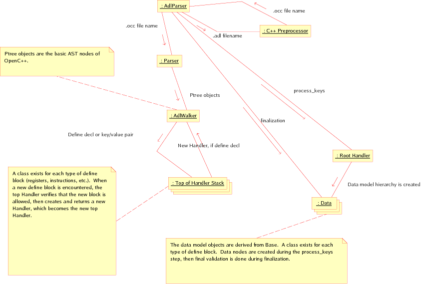
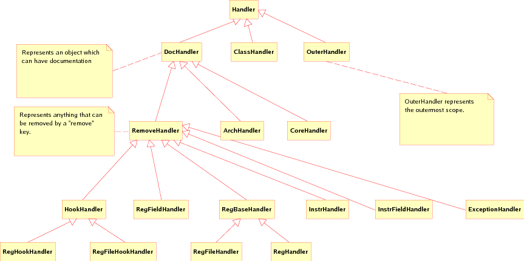
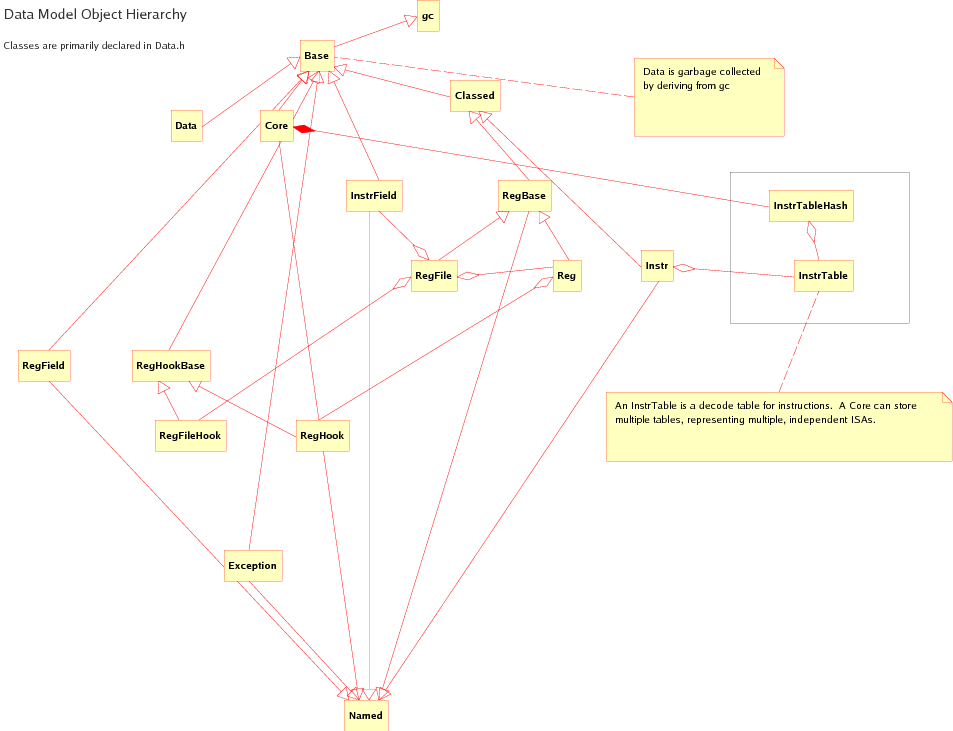

=============================
ADL Front-End Design Document
=============================

This document describes the high-level design of the ADL front-end.

:Author:
  Brian Kahne
:Contact:
  bkahne@freescale.com

.. contents:: Table of Contents
   :backlinks: entry

.. sectnum::

Overview
========

The ADL system is explicitly divided into a front-end, which does the parsing,
some error checking, and creates a data model, and various back-end clients
which use this data to create or configure various tools.  This document deals
with the front-end library and how to use it.

The library is called ``libAdlFrontEnd.la``.  This is a libtool library.  The
actual shared-object and static libraries also exist, and have the same name
with the appropriate extension.

The library is implemented in garbage-collected C++.  Thus, the user should not
delete anything- the collector will take care of it.  Also, it is *very*
important to not mix the garbage collector and default STL classes.  This is
because the garbage collector cannot see into the memory allocated by the
default allocator.  Instead, one should use the various container classes
contained classes provided, which are simply the STL classes with a GC
compatible allocator.  For example, include ``gc_vector.h`` and instantiate
``gc_vector<int>`` to create a garbage-collected vector of integers.

Library Usage
=============

The main entry point for using the parser is the class ``AdlParser``, contained
in the header file ``AdlParser.h``.  The parser is run using the ``parse``
method, which takes a configuration object of type
``Opencxx::MetacompilerConfiguration``.  The data model can then be accessed by
calling the ``data`` method.

Front-End Design
================

The parsing of the C++ is handled using `OpenC++`_, an open-source C++
parsing/meta-programming library.  The version used is contained within the
Plasma project because various bug-fixes and minor feature enhancements were
made.  However, the overall OpenC++ documentation is still valid.

.. _OpenC++:  http://opencxx.sourceforge.net/

The ``AdlParser`` class calls the OpenC++ library to run the C preprocessor and
then to parse the resulting code into an AST.  It also adds in the syntax
extensions that ADL uses, e.g. "define", "defmodify", and "func".  A visitor
pattern is then used to process the result: The ``AdlWalker`` class walks the
AST and its member function ``TranslateUserPlain`` is called whenever a
``define`` or ``defmodify`` block is encountered.  It then iterates over the
contents of the block, calling the appropriate methods of the top item on the
``Handler`` stack.

Once this pass is complete, the result is a tree of ``Handler`` objects.
This tree is then processed to create the actual data model.  Next, a
finalization pass is made on the data model to do the final checking.

Thus, the basic parsing steps for the front-end are:

1. The C++ preprocessor takes the original input (which may span multiple files)
   and creates a single ``.occ`` file.

2. The ``.occ`` file is processed into an AST (the base class for which is
   called Ptree) by the Parser class (an OpenC++ class).  This also constructs
   a tree if Environment objects for symbol lookup.  The Ptree objects are fed
   to AdlWalker, a visitor class which has a stack of Handler objects.

   * The AdlWalker, if it encounters a define or defmodify block, sends the
     type and name to the top Handler on the stack.  It decides if the item is
     valid and creates a new Handler, which is then added to the stack.

   * Key/value pairs are sent to the top Handler, which does basic data validation.

3. The AdlParser calls ``process_keys`` on the root Handler, causing the data
   model to be constructed.  That is, each Handler instantiates necessary data
   items, then calls ``process_keys`` on any child Handler objects it owns.

4. AdlParser calls ``finalize`` on the root Data item.  Final data validation
   is done at this point, including creation of the instruction decode tables.

Graphically, the process looks as follows:

   Data Model Creation

Handlers
========

The ``Handler`` class (declared in ``Handler.h``) is the base class for the tree
constructed during the first third pass.  Each derived class (in ``Handlers.h``)
stores key-value pairs and knows what child blocks it may have.  During the
fourth-pass, the actual data model is constructed and populated using the
information in the handlers.  Again, some data checking is done at this point,
but not everything can be done here.  During the finalization phase, the final
checking is done.

The point of constructing a Handler tree, then creating the actual data model is
to ensure that the order of declarations in ADL does not matter:  It is possible
to declare instruction fields after instructions that use then, etc.  This
allows the code to be structed the way the user wants, rather than how the
parser needs it to be.  

The Handlers are also needed so that the data model of a core can be constructed
from a series of architecture definitions.  In other words, the Handler tree has
objects which represent the items found in an architecture.  When the fourth
pass occurs, only the relevant architecture objects are traversed.  They all
write their data into the data model ``Core`` object.  Thus, the data model has
a flattened representation.

A hierarchy exists of Handler objects for dealing with common cases.  For
instance, anything that processes a *remove* key should derive from
``Remove``.  Refer to the header file for documentation about the public
interface.

   Class Diagram For The Handler Classes

Data Model
==========

The data model code is declared in ``Data.h``.  The base class is called
``Base`` and derived classes exist for all of the various components.  The data
model itself is constructed by the Handler objects.

   Class Diagram For The Front-End Data Model

Adding New Items
================

Should you need to add a new item to the language, the following steps should be
performed:

1. Create a new Handler object to store the initial information.  The object
   should be created by its parent in the ``add_define`` method and stored
   within the parent inside of a data structure.  Most objects are stored in a
   ``gc_list`` of pointers to that object.

2. Modify the parent's ``process_keys`` function to iterate over the objects.
   The generic ``process_items`` function can be used to simplify this:  It
   will create a new data model object of the appropriate type, check the
   remove flag, etc.

3. The new Handler object should have a ``handle_key`` method for handling
   key/value pairs.  This function should call ``unknown_key`` if the key is
   not recognized.  Generally, you just call ``strcmp`` to check for what key
   you have, then process the data.  Various functions, such as ``get_ident``
   and ``get_uint`` exist for extracting data.  These are declared in
   ``Helpers.h``.

4. Create a new data model object, derived from ``Base``.  The relevant handler
   can be a friend, for simplicity.  The handler will configure the data
   object, but this step should be done in such a way that you do not query the
   data model, at that point, for other information.  You will also have to
   create a data structure in the parent to store these items.

5. Create a ``finalize`` method for the data model object and modify its parent
   to iterate over the relevant data structure and call this function.  At this
   point, it is okay for to query the data model.  Make sure that the ordering
   of when these objects are finalized is all right, with respect to its
   dependencies.  For example, instructions are processed after instruction
   fields so that each instruction can query to see if the listed fields are
   valid.  The dissassembly tables are created after all instructions have been
   processed.

Error Handling
==============

Error handling is done via exceptions.  In general, the idea is to allow
multiple error messages.  In the ``Handlers.C`` and ``Data.C`` files, a macro
called ``PError`` exists to make it easy to throw ``parse_error`` exceptions.
This exception class takes a message and a ``Ptree`` pointer in order to provide
a location.  The data model objects have a function, ``loc()``, which returns
its location for error reporting purposes.

Within handlers, just call ``PError``:  The visitor class (``AdlWalker``) will
catch and log these, then continue parsing.  Within the data model objects, you
can still use ``PError``, but you should catch these using the ``LogPError``
macro, which will add the information to a ``MsgLog`` object which should be
passed down through the hierarchy.

