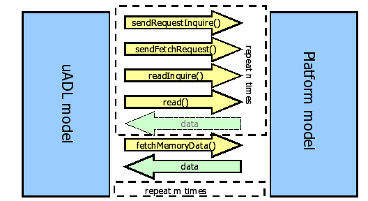
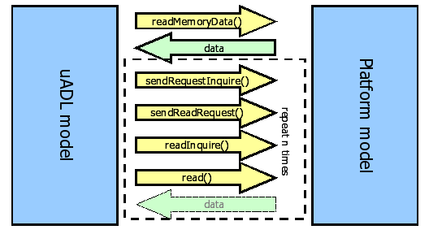
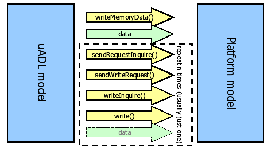
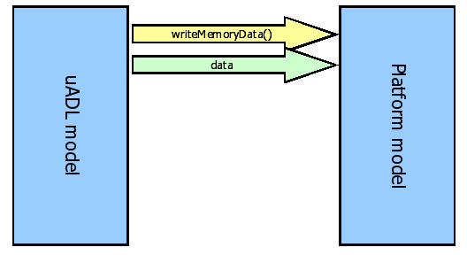
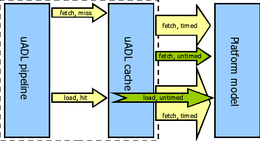

===========================
The uADL Language Reference
===========================

:Author:
  Brian Kahne
:Contact:
  bkahne@freescale.com

.. contents:: Table of Contents
   :backlinks: entry

.. sectnum::

General Overview
================

This manual documents the uADL language, a description language for
processor core micro-architectures.

It is organized as follows:

* `The uADL Language`_ describes the basic syntax and semantics of the
  language.

* `The Resources Section`_ documents existing processor resource types and their
  transaction interfaces.

* `The Machine Section`_ documents the finite-state machine description used to
  model the processor pipeline.

* `The Instruction Class Section`_ documents instruction classes, which group
  instructions with common timing together and describes their pipeline
  behavior.

* `Running A Model`_ describes how to create and run your own models.

* `Integration`_ documents interfaces for integration into a system model.

The uADL Language
=================

This chapter explains how to use the uADL language to describe a processor.
The basic syntax used in this language is the same as for ADL, but with
definition blocks relevant to describing a processor pipeline.  Please refer to
the `ADL Language Reference Manual`_ for a complete overview of the *define*
and *defmod* syntax.

In short, a description consists of blocks named ``define`` and ``defmod``.  A
``define`` defines an entity, while a ``defmod`` modifies an existing entity.
These blocks may be nested and/or contain key value pairs of data.  The C
preprocessor may be used to break a description into multiple files via the
``#import`` directive and substitutions may be made via the ``#define``
directive.

A define block takes the form of::

  define (type=name) {}

or::

  define (type name) {}

or::

  define (type=(name1, name2, ...) {}

The same syntax is used for a ``defmod`` block.  If a list of names are
supplied within the define or defmod, then the definition or modification is
replicated for each named item.

A complete uADL description consists of an outer core define block which then
contains three to four main types of sections: the **resources** section,
**machine** sections, and **instruction class** sections.  A **thread** or
**thread_group** section is optional and is used to describe resource sharing
for a multi-threaded processor.  These sections may occur in any order and may
be split across files via the use of ``#import`` and the use of defmod blocks.
Various helper functions and other minor defines and keys may occur within the
core block and are documented in `Core-Level Scope Defines`_.  Thus, the basic
structure of a design looks like::

  define (core P) {
    define (resources) {
      ...
      // Define pipeline stages, memories, caches, etc.
      ...
    }
    define (machine <name>) {
      ...
      // Define states used by instruction classes. 
      ...
    }
    define (instr_class <name>) {
      ...
    }
    ...
    // Define additional instruction classes.
    ...
  }

The **resources** section of a model lists various processor resources, such as
pipeline stages, branch predictors, caches, and memory, and allows the user to configure these
resources.  Custom resources are also supported:  A user may specify a C++
class, via a header file, and configure constructor and template parameters via
the same syntax as used for configuring built-in resources.

Within an instruction class's action code, the resources may be referred to by
name and queried or modified by calling various methods.  These interface
methods are listed below in the documentation for each resource type.

The **machine** section describes the state machines which lie at the heart of
the uADL model.  Each machine consists of a series of states mapped to pipeline
resources.  The mapping may be very general and allows for an arbitrary number
of states to be mapped to a stage.  In addition, exception handling states and
mappings can also be described.  If an exception occurs in a given state, this
describes the state transition which will occur.  

Multiple machines may be defined, though for simpler processors it often makes
sense to just define a single machine.  If only a single machine exists, then
this is used as the default and instruction classes will not need to specify it.

Finally, the **instr_class** sections define instruction classes.  In uADL, all
instructions, plus special instructions such as decode misses and fetch
exceptions, are combined into common classes.  Each instruction class represents
the behavior of similar instructions in terms of how they interact with resources
and propagate through the pipeline via state transitions.  Much of the
flexibility of uADL comes from this concept: Adding new instructions does not
require that the pipeline model be ripped up and modified.  Instead, new
instructions are simply assigned to existing or new instruction classes.

Operation State Machine Theory
------------------------------

OSM Definition
++++++++++++++

The Operational State Machine (OSM) is the pipeline model used by uADL.  An
OSM model is associated with an instruction class.  Each state of an OSM model
is mapped to a pipeline stage, and each edge of an OSM model represents a
pipeline stage transition.  Each state is also associated with C++ code which
inquires and acts upon various processor resources.

Graphically, an OSM model looks like:

.. figure:: OSM.png

   A sample OSM model: The *sfx* instruction class of a five-stage pipeline.

To make an OSM model semantically complete, an artificial initial state is
introduced, which does not correspond to any pipeline stage.  When an OSM is at
the initial state, it is idle with no instruction loaded.  Any edge leading to
the initial state indicates that the instruction retires by following this edge.
Any edge leaving the initial state indicates that a new instruction is loaded by
following this edge.

The behavior being modeled is just the timing behavior of the instructions.  The
functional behavior, such as what an "add" instruction actually does, is modeled
by an ADL description and is not part of the OSM model.  The pipeline model
interacts with the functional description using a small set of interface
methods.  For example, in the figure, the call to ``exec()`` causes the
instruction to actually perform its calculation.

Resources and their interface methods are described in `The Resources Section`_.
A resource inquiry method returns either success or failure (true or false).  In
order to make a state transition, all inquiries attached to the state must
return success.  In other words, if any inquiry returns false, the transition
cannot occur.

While OSM code interacts with some resources directly, such as memories,
register resources are hidden within **operands** in order to simplify the
description.  An operand maps various register, register-file, or immediate
operands to a name.  Different instructions within the same instruction class
may have different resources mapped to the same name.  For example, a PowerPC
``add`` instruction might have one of its source registers, e.g. ``GPR(RA)``
mapped to the operand **Src1** while the ``or`` instruction has ``GPR(RS)``
mapped to **Src1**.  In both cases, these are source registers which behave in a
similar manner.  The action code for the instruction class can thus manipulate
**Src1** and not worry about the differences between the operands of ``add`` and
``or``.

This is also true when operands differ in type, such as between a register-file
operand and an immediate operand.  For example, both a PowerPC ``add`` and
``addi`` (add-immediate) instruction might have a **Src1** operand mapped to
``GPR(RA)``.  However, the ``add`` maps **Src2** to ``GPR(RB)`` while ``addi``
maps **Src2** to ``D``, its immediate value.  The action code will manipulate
**Src2** using the same interface, but, an inquiry to see whether **Src2** is
available for reading will always return true for ``addi``, as it is an
immediate value.  This optimization is performed at compile-time, using C++
templates, thus eliminating this overhead during model execution.

In summary, the underlying finite state machine of an OSM model depicts the
structural data path of an instruction, while the code attached to the states
models the instruction's pipeline performance behavior.  An OSM model does not
necessarily model the entire pipeline because it only contains pipeline stages
that are reachable by the associated instruction class.  In other words, an OSM
model only represents a local view of the pipeline by the instruction class.

For example, an integer class OSM model does not cover floating-point execution
stages.  The union of OSM models of all instruction classes constitute a global
view of the entire pipeline.  This modeling approach, combined with the
separation of micro-architecture and functional behavior, enables the model
developer to divide the entire pipeline into multiple subsets based on
instruction classification, and model each subset independently.  This can prove
very effective in reducing modeling complexity when dealing with
micro-architectures with complex pipelines.

Instruction Scheduling
++++++++++++++++++++++

The processor model simulates by iterating over pipeline stages and executing
any instructions (OSMs) contained within those stages.  The instruction's
current state action is then executed; if it changes state via a call to
``change_state()``, and the subsequent state is mapped to a different pipeline
stage, then execution ends for the current cycle.  Otherwise, the next state is
executed.  

The ability to execute multiple states in a single cycle, as long as
they correspond to the same pipeline stage allows complex conditionals to be
broken down into smaller pieces.  For example, one common idiom is to perform
some actions immediately when an instruction enters a state, even if the
instruction cannot make further progress because of a stall in a subsequent
instruction.  This may be modeled by breaking the code into two states:  An
initial state which performs the action and a secondary state which tests for
the ability to move to the next stage::

  S1: if ( Src.can_read() ... ) {
    // Perform actions.
    Src.read();
    ...
    change_state(S2);
  }
  S2: if ( m2.has_space() ) {
    change_state(S3);
  }
  
In the above example, S1 and S2 map to the stage **m1**, while S3 maps to the
stage **m2**.  An instruction enters **m1** via state S1 and then performs an
operand read if possible.  It then transitions to S2, where it moves to stage
**m2** (state S3) only if there is space, at which point it is done for the
current cycle.  If a stall has caused an instruction to still be in **m2**, then
the initial actions in S1 are still performed and the instruction will simply
wait in S2 until space is available.

Instruction Classification
++++++++++++++++++++++++++

Instruction classification is arbitrary.  It should normally follow the natural
instruction groups, i.e. integer arithmetic, floating-point arithmetic, load,
store, branch, etc..  Different classes are needed when behavior differs
dramatically, e.g. between instructions which operate upon memory versus those
which do not.

Pseudo Instructions
+++++++++++++++++++

Normally, instruction classes list instructions which are defined by the
functional (ADL) description.  Several pseudo instructions exist, however, for
dealing with special situations.  These may appear within the ``instructions``
list of an instruction class.

*decode_miss*:
  Used to describe the behavior of an illegal instruction.

*default_instruction*:
  Used to provide default behavior for any instructions not explicitly listed
  within any other instruction class.  Normally, all instructions must be listed
  if **allow_unimpl_instrs** is false (the default).  Using this pseudo
  instruction allows the user to not have to explicitly list all instructions.

*fetch_exception*:
  Used to describe the behavior of a fetch-exception.

Automatic Deallocation of Resources
+++++++++++++++++++++++++++++++++++

When a pipeline flush occurs, resources held by an instruction must be
deallocated. In uADL, resource allocations are virtual, in that the instruction
itself holds no information about what resources have actually been
allocated. Instead, the instruction's location within the instruction-class
state-machine indicates what is allocated. 

When a flush occurs, an automatically generated flush function is called. This
attempts to deallocate any resources which have been allocated. The algorithm
for determining this is to examine all prior states and find resource and
operand method calls which start with allocate, e.g, ``Sem1.allocate()``,
``Mem.allocate_force_lock()``, etc., and then to call the corresponding
deallocate method to deallocate the resource. For this reason, all resources,
including custom resources, should follow the guideline that all allocation
methods start with **allocate** and all deallocation resources start with
**deallocate**.

Safe-Mode and Normal Mode Models
++++++++++++++++++++++++++++++++

A single uADL description may be used to produce two different types of models,
known as **normal** and **safe-mode**.  In a normal-mode model, each instruction
stores within it all operand values.  Instruction execution acts upon these
copied values and architectural state is only updated when the instruction
explicitly writes its operands.  A safe-mode model, on the other hand, acts as a
loosely coupled ISS and pipeline model.  The functional portion (the ISS)
executes the complete instruction immediately at issue-time; the instruction travels through
the pipeline simply for timing purposes.

On the one-hand, a normal-mode model can more accurately describe the timing of
a complex core, with respect to its external interactions, since memory
operations can be performed in the appropriate pipeline stage, rather than all
at once.  This type of model can also more easily handle speculative execution,
since architectural state is only updated when an instruction is committed.
Finally, it can also be used for discovering model issues; a timing error
resulting from not reading a forwarding path and advancing with incorrect data
will result in a wrong value which can be easily detected.

On the other hand, in some situations it is more important to have 100% correct
functional behavior and the timing behavior need be only approximate or needs to
only model a portion of a processor.  In this case, a safe-mode model is
appropriate.  Timing errors will not produce bad functional values, as
forwarding paths are simply used for timing purposes.

Core-Level Scope Defines
------------------------

This section describes core-level configuration parameters and miscellaneous define
blocks.

* *allow_unimpl_instrs = <bool>*: If false (the default), then all instructions
  found in the functional (ADL) description must exist in an instruction class
  in the uADL description, or else an instruction class must exist which
  contains the special ``default_instr`` pseudo-instruction.

* *branch_hook = func(InstrType &) {}*: If present, this is called after a
  branch's instruction handler has executed, for safe-mode models.  This hook
  may be used, for example, to set the speculative state of the model based upon
  the branch predictor's prediction.

* *commit_on_exception = <bool>*: This controls whether an exception's actions
  should be taken immediately when the exception occurs, or whether the user
  will explicitly control the behavior.  If true, then the model automatically
  generates calls to ``commit_exceptions`` and ``flush`` on the state transition
  to an exception state.  The default is true.

* *dead_lock_timeout = <int>*: This specifies the
  timeout value (in cycle) of a dead/live-lock situation.  For example::

    dead_lock_timeout = 100

  This means after 100 idle cycles, an instruction that gets stuck is deemed
  locked and will be removed.  This parameter is only used by the safe mode.  It
  is ignored otherwise.

* *mem_access = func(UadlMemAcess) { }*: If present, this hook is called
  whenever a memory access is performed.  It may be used to modify the status of
  the memory access object, such as turning on the serialized flag if the
  address falls within a certain range or a certain translation parameter is
  set.  Note that this function is instantiated in the scope of the ADL ISS
  object, and thus the ADL registers, MMU, etc., are accessible.

* Definition: *mem_alias*: Allows the user to create memory aliases.  This maps
  alias names to memory or cache resources, allowing instruction-class behavior
  to be generic.  For example, an alias of ``DataMem`` might map to memory for
  one model and a data cache for another model.

  Each key in the define block is an alias name.  The value is the name of a
  memory, cache, or memory port.  For example::

    define (mem_alias) {
      InstrMem = L1i;
      DataMem  = Mem.D;
    }

  In this example, ``InstrMem`` maps to a cache named ``L1i`` and ``DataMem``
  maps to the ``D`` port in the memory ``Mem``.

Helper Functions
++++++++++++++++

A model may also contain helper functions within the core-level scope.  These
functions may access resources, such as caches, just as instruction-class action
code is able to, and are provided as a way to re-factor and simplify a design.

Since helper functions are written at the core-level scope, they do not have
automatic access to an instruction class's operands.  They do have access to the
objects declared in the **resources** section and are also able to call helper
functions declared in the ADL description.

It should also be noted that when a resource's method is called within an
instruction class, three special parameters are automatically added to the front
of the method call: A reference to the core's class, a reference to the current
instruction, and a pointer to the logger.  These parameters are not
automatically added within a helper function and must thus be added by the user.

For example, within an instruction class, a cache method can be called with no
arguments::

  L1d.can_requests_cmd();

Within a helper function, this call would have to be changed to add on the
necessary parameters::

  bool check_l1d (InstrType &instr,Logger *logger) {
    L1d.can-request_cmd(thisCore(),instr,logger);
  }

  ...
  S_Exec: if (check_l1d(thisInstr(),logger)) { ... }


Since the helper is a member of the core's class, a reference can be supplied by
calling ``thisCore()``.  The type ``InstrType`` may be used as the instruction's
type and the logger's type is ``Logger``.  The function ``thisInstr()`` can be
used to retrieve a reference to the current instruction within an instruction
class.

The Thread/Thread-Group Section
-------------------------------

The **thread** and **thread_group** defines are used to describe resource
sharing within a multi-threaded design.  These blocks must match the system/core
hierarchy within the corresponding ADL description.  The basic structure is::

  define (thread=<name>) {
    define (resources) {
      ...
    }
  }

  define (thread_group=<name>) {
    define (resources) {
      ...
    }

    <thread or thread_group definition>

  }

A **thread** definition must correspond to a **core** definition in the ADL
description; it will contain a **resources** block describing resources local to
the thread.  A **thread_group** definition may contain nested thread groups or
**thread** definitions, as well as a **resources** definition.

Note that the thread hierarchy should only match the system/core declarations in
the ADL description, not the instances of those systems or cores.  For example,
given an ADL hierarchy such as the following::

  define (system=top) {
    define (system=Foo) {
      define (core=Bar) {
        ...
      }
      Bar b0;
      Bar b1;
    }
    Foo f0;
    Foo f1;
  }

the corresponding uADL hierarchy would be::

  define (core=top) {
    define (thread_group=Foo) {
      define (thread=Bar) {
      }
    }
  }

The uADL front-end will take care of replicating ``Foo`` and ``Bar`` in the uADL
description as necessary, based upon the instances found in the ADL hierarchy.

Within each thread-group or thread block should be a resources block which
defines what resources are local to the thread or group of threads.  So, for
example, if each thread contains its own simple-fixed-point pipeline, then those
stages should be placed within the resources section of that thread define.  If
the core contains a shared complex-fixed-point pipeline, then those pipeline
stages would be declared at the outer-most level.

Resources declared in the ADL hierarchy are automatically imported at the
correct hierarchy level.  For example, a shared L2 in the ADL description is
automatically imported at the top-level, whereas thread-private L1 caches would
be imported into the corresponding thread resources.

The Resources Section
---------------------

The resources section contains definitions of various processor resources, e.g.  register
files, caches, etc., of the processor.  It has the following structure::

  define (reources) {
    define (<type> <name>) {
      <parameter> = <value>;
      ...
    }
  }

Fetch Unit
++++++++++

Type name:  ``fetchunit``.

A uADL model must have one fetch unit.

Below is a typical fetch unit definition::

  define (fetchunit fetcher) {
    fetch_memory = MEM;   // fetch from MEM
    entries      = 2;     // 2-entry instruction buffer
    entry_size   = 4;     // four-byte entry
    fetch_size   = (4,2);
    min_fetch_entries = 0;
    can_cancel   = true;
    reuse_data   = false;
  } 

Parameters
~~~~~~~~~~

* *fetch_memory = <ident>*:  Instruction source memory.  Must be a defined
  memory or cache in the architecture (ADL) description.

* *entries = <int>*:  Number of entries.

* *entry_size = <int>*:  Entry size, in bytes.

* *fetch_size = <int>|<list(int)>*:  Set of valid fetch sizes, in bytes.

* *interleaved = <bool>*: If true, then for a multi-threaded architecture, the
  fetch operations of the threads are interleaved, rather than each thread fully
  executing fetch and issue before passing control to the next thread.

* *max_fetch_count = <int>*: Specify the maximum number of fetches to be
  performed in a single cycle.  Defaults to unlimited, which means that the main
  restriction will be the memory subsystem.

* *min_fetch_entries = <int>*: This parameter, if not 0, specifies the minimal
  number of instruction buffer entries that should be vacant before the fetch
  unit can initiate a new fetch.  When it is 0, the mininal required space for a
  new fetch is the greatest fetch size.

* *branch_predictor = <ident>*: Name of an associated branch predictor.  This is
  an optional parameter.  If this parameter is defined, the fetch unit will
  consult the associated branch predictor for predictions during fetch time, and
  direct fetch flow accordingly.  You cannot use fetch-time branch prediction
  and explicit branch prediction at a stage (through instruction class's action
  code) at the same time.

.. _can_cancel:

* *can_cancel = <bool>*: Specifies whether the fetch unit can cancel pending
  fetch requests upon an instruction buffer flushing caused by change of flow.
  Specifically, the fetch unit will instruct its instruction memory to do deep
  cancellation (can_cancel = true) or weak cancellation (can_cancel = false)
  when it needs to abandon some pending fetch requests.

* *reuse_data = <bool>*: This parameter affects how the fetch unit respondes to
  change-of-flows.  If reuse_data = false, which is the default, when a
  change-of-flow occurs, the fetch unit does a full flush of the instruction
  buffer and start fetching from the target address.  If reuse_data = true, when
  a change-of-flow occurs, the fetch unit first checks if the target address is
  already in the instruction buffer or is covered by an outstanding fetch
  request, and if such a hit condition exists, the fetch unit only flushes to
  the point before the target address and does not re-fetch.

* *lazy_fetch = <bool>*: When *lazyFetch* is set to ``true``, the processor will
  issue fetch requests only if at the beginning of the cycle, the instruction
  buffer has space for more instructions.  When *lazy_fetch* is set to ``false``,
  the processor will issue fetch requests even if at the beginning of the cycle,
  the instruction buffer is full, but will have space by the end of the cycle
  because some instructions are dispatched during that cycle.  For most
  processors, *lazy_fetch* should be set to ``true``.

* *flush_fetch = <bool>*: If true, then a new fetch is always attempted after a
  pipeline flush.

Interface Methods
~~~~~~~~~~~~~~~~~

*void cancel()*:
      Cancel outstanding transactions in the fetch unit.  Similar to
      ``flush()`` except that held data is not flushed; only new transactions
      are stopped.  As in ``flush()``, the optional boolean parameter allows
      the user to override the default `can_cancel`_ behavior of the fetch unit.

*void flush()*:
      Flush just the fetch unit.  If there were existing entries, or pending
      requests, then the next fetch will be to the first entry or pending
      request that was in the unit.  This is not intended for a change in
      control flow, but as a means of reseting the unit, due to special
      instructions which might change machine state.

      A boolean parameter may be specified to override the normal `can_cancel`_
      behavior of the fetch unit.

*void force()*:
      Force a new fetch operation to occur.

*void pause()*:
      Pause the operation of the fetch unit.

*void set_cancel(bool)*:
      This allows the user to override the default *can_cancel* policy of the
      fetch unit.  This command is only relevant for the next call to a
      fetch-unit method, such as **cancel**.

Pipeline Stage
++++++++++++++

Type name:  ``pipestage``.

This describes a stage in a processor's pipeline.  A pipeline can store one or
more instructions and can behave in various ways, such as in a lock-step manner
(instructions march through together) or as a queue, such as to model a re-order
buffer.

Below is a typical pipeline stage definition::

  define (pipestage=foo) {
    size = 1;
    issue = false;
  }

The issue stage (the stage mapped to the `init_state`_) is not explicitly
declared by the user, but can be referenced using the name *Issue*.  It can
store a single instruction in the case of stalls from the decode stage.
Normally, the only reason to reference this stage is to query its instruction
for attribute information.

Parameters
~~~~~~~~~~

* *bandwidth = <int>*:  Number of instructions that can enter the stage in one
  cycle.  Default value is 1.

* *issue = <bool>*:  Whether this stage is the issue stage.  Default value is
  ``false``.

* *_`lock_step` = <bool>*: If true, all instructions in the stage transition only
  if all instructions' state-actions evaluated to true.  This allows for the
  modeling of in-order multi-issue machines, in which instructions travel
  together down the pipeline.

* *size = <int>*:  Number of instructions the stage can simultaneously hold.
  Default value is 1.

* *rigid = <bool>*: If true, then this stage is to be considered part of a rigid
  pipeline. The has_space() predicate returns false if a stall has occurred.

Interface Methods
~~~~~~~~~~~~~~~~~

* *unsigned capacity()*: Returns the total capacity for this stage.

* *bool has_space()*: Returns true if the stage has the necessary space.

* *bool has_space(unsigned n)*: Returns true if the stage has space for n
  instructions.

* *bool empty()*:  Returns true if the stage is currently empty of all
  instructions.

* *bool has_attr(unsigned index,unsigned attr)*:  Returns true if the
  instruction at the specified position in the stage contains any attributes as
  specified by ``attr``.  Attributes are defined within instruction classes
  using the ``attrs`` key.

* *bool has_attr(unsigned attr)*: Returns true if the first instruction in the
  stage (position 0) has the specified attributes.

* *unsigned instr_class(unsigned index = 0)*: Returns the instruction class
  currently located at the specified position in the stage.  Enumerated values
  are automatically created for all instruction classes, of the form
  ``name_class``, where ``name`` is the name of the instruction class.

* *unsigned size()*: Returns the number of instructions currently in the
  pipeline stage.
 
Forwarding Paths
++++++++++++++++

Type name:  ``forwarding_path``.

A forwarding path allows an instruction in the pipeline to send computed results
to other instructions further back in the pipeline, allowing them to proceed
before architectural state has been updated.  A forwarding path may store one or
more items of data; each item of data is tagged and can be checked to make sure
that it is valid.

Below is a typical forwarding path definition::

  define (forwarding_path foo) {
    size = 4;
  }

Parameters
~~~~~~~~~~
* *broadcast = <int>*: If false, then a forwarding path will only return a match
  if its tag (identifier of the instruction which wrote the value into the
  forwarding path) matches the register's last allocator.  If false, then this
  value is not checked, making it suitable for use as a broadcast completion
  bus.

* *size = <int>*: Number of operand values the forwarding path can hold.

* *width = <int>*:  Maximum width of the data.  Automatically set to the size of
  the program counter if not specified.

Interface Methods
~~~~~~~~~~~~~~~~~

Rather than use member functions of the forwarding path, checking for data
availability is performed via the **can_read_fp()** function and reading of the
actual data is done via the **read()** function.

* *void write(Operand)*: Write data from the operand to the forwarding path. 

Branch Predictor
++++++++++++++++

Type name:  ``branch_predictor``.

Below is a typical branch predictor definition::

  define (branch_predictor foo) {
    algorithm     = Counter;
    size          = 8;
    counter_width = 2;
  }

Currently, only the ``Counter`` branch predictor is built into uADL, but custom
branch predictors may be supplied by the user.  A custom branch predictor
behaves like a custom resource, in that template and constructor parameters for
the class may be specified within the **args** define block.

Parameters
~~~~~~~~~~

* *algorithm = <ident>*:  Specifies the branch predictor algorithm to be used.
  If the algorithm is not recognized as an internally supported one, then it is
  assumed that the algorithm is custom.  Refer to `Custom Branch Predictors`_
  for more information about how to use this feature.

  Currently, the only internally supported algorithm is ``Counter``, a simple
  single-counter branch predictor with a maximum number of entries and a fixed
  counter width.

* *counter_width = <int>*: Bit-width of the prediction counters, for the
  standard ``Counter`` type.

* *enable = func() {}*: A boolean predicate which specifies whether or not the
  predictor is enabled.  This may reference any architectural resource, such as
  registers.

* *header = <str>*: Specify the header file name for a custom branch
  predictor. Defaults to ``<algorithm>.h``, where ``algorithm`` is the value of
  the **algorithm** parameter. The file is searched for in the current
  directory, then in any additional directories specified using the
  **--include** or **-I** command-line options.

* *reg_compares = <ident|ident.ident|list(ident|ident.ident)>*:  This feature
  allows the user to specify additional criteria to match against when searching
  entries in the branch predictor.  This may be either a single element or list,
  where each element is either a register name or of the form
  **register.field**.  For example::

    reg_compares = (MSR.IR,PID);

  In the example above, when the predictor is updated, the current architectural
  state of the **IR** field of the **MSR** register and the **PID** register
  will be stored in the branch predictor entry.  During a prediction, the
  current architectural state of these registers must be equal to the values
  stored in an entry in order to be considered a match.

* *size = <int>*: Number of entries in the predictor, for the standard
  ``Counter`` type.

* Definition: *args*: For custom branch predictors, each key/value pair within
  this block is considered an argument. Both template and constructor arguments
  will be searched.

Interface Methods
~~~~~~~~~~~~~~~~~

*bool enabled()*:
  Returns true if the predictor is enabled.

*bool last_predict_taken()*:
  Returns true if the last branch was predicted taken.

*bool last_predict_taken(addr_t &target)*:
  Returns true if the last branch was predicted taken.  If it was taken, then
  target is updated with the branch target.

*std::pair<Prediction,addr_t> predict()*:
  Read branch prediction from the branch predictor.  This returns a pair, where
  the first item is an enum with the values ``Miss``, ``Taken``, ``NotTaken``,
  or ``NoPrediction``.  The second element is the predicted target address, if
  relevant.  This generally only needs to be called if the branch predictor is
  not implicitly used by the fetch unit (via the **branch_predictor** key).

*void update()*:
  Update the branch predictor with branch outcome.  Only relevant if called by a
  branch instruction, which internally updates the core's branch-target.

Memory
++++++

Type name:  ``memory``.

Below is a typical memory definition::

  define (memory mem) {
    addr_bandwidth = 1;
    data_bandwidth = 1;
    read_latency   = 1;
    write_latenchy = 1;
    max_requests   = 1;
    allow_bus_wait = false;
    preemptive     = false;
    read_only      = false;
  }

Parameters
~~~~~~~~~~

* *addr_bandwidth = <int>*: Maximum number of requests that can be received per
  cycle for address handling (requests).  Default is 1.

* *data_bandwidth = <int>*: Maximum number of data transactions (reads/writes)
  that can be done per cycle.  Default is 1.

* *data_width = <int>*: Width, in bits, of the largest data access.

* *read_latency = <int>*:  Read latency in cycles.  Default is 1.

* *write_latency = <int>*:  Write latency in cycles.  Default is 1.

* *max_requests = <int>*:  Maximum number of pending requests.  Default is 1.

* *allow_bus_wait = <bool>*: True if the memory can have a request waiting on
  the "bus" if the request queue is full.  Default value is ``true``.

  uADL does not explicitly model buses, so this merely provides one additional
  request buffer space.  A request under bus-waiting status is not processed
  until it is moved into the request queue.

* *preemptive = <bool>*: A preemprive memory gives higher priority to
  loads/stores over instruction fetches.  Specifically, when the pipeline tries
  to send a read/write request to the memory, and the memory has no space to
  receive new requests, if the last request is a fetch and has not been "taken"
  by the memory, then the memory will accept the read/write request and let it
  "preempt" (in other words, overwrite) the last fetch request.  The fetch unit
  then needs to re-send the preempted request.

  A request is considered "taken" if it is in the request queue, hence only a
  fetch request that is waiting on the bus can be preempted.  So a preemptive
  memory must have allow_bus_wait set to true.  There are two limitations on
  defining a memory to be preemptive.  A preemptive memory must be a unified
  memory, i.e., it cannot be instruction-only or data-only memory.  A preemptive
  memory must be the first-level memory in the memory system, i.e., the closest
  to the pipeline.  If preemptive is set to true but the memory does not meet
  these requirements or has allow_bus_wait set to false, the preemptive
  attribute is ignored.

  The default is non-preemptive.

* *read_only = <bool>*:  True if read-only.  Default value is ``false``.

Interface Methods
~~~~~~~~~~~~~~~~~
*bool request_queue_empty()*:
  Returns true if the memory has no active/pending memory requests.  Returns
  false otherwise.

*bool is_inactive()*:
  Returns true if the memory has had no activity for this cycle.  For example,
  ``request_queue_empty`` might return true if a fetch transaction completed in
  this cycle, whereas this would return false, since there was activity during
  the cycle.

*bool can_request_read()*:
  Returns true if the memory can accept a read request.

*bool can_request_write()*:
  Returns true if the memory can accept a write request.

*bool can_read()*:
  Returns true if the memory can accept a read.

*bool can_write()*:
  Returns true if the memory can accept a write.

*bool can_accept_read_request()*:
  Returns true if the cache can accept additional read requests. 

*bool can_accept_write_request()*:
  Returns true if the cache can accept additional write requests.

*void send_read_request([unsigned num_bytes])*:
  Send a read request to memory.  This transaction requires that the request
  address is already calculated, so ``exec()`` must already have been called.
  The size is normally set by the instruction's functional behavior.  However,
  in some circumstances, the user will want to override this default size, in
  order to fetch a larger chunk of memory at once.  For example, a load which
  fetches data in 64-bit chunks, even though the instruction acts as though it is
  fetching multiple 32-bit chunks.  In this case, *num_bytes* bytes of data are
  requested.

*void send_write_request([unsigned num_bytes])*:
  Send a write request to memory.  This transaction requires that the request
  address is already calculated, so ``exec()`` must already have been called.
  The size is normally set by the instruction's functional behavior.  However,
  in some circumstances, the user will want to override this default size, in
  order to fetch a larger chunk of memory at once.  For example, a store which
  writes data in 64-bit chunks, even though the instruction acts as though it is
  writing multiple 32-bit chunks.  In this case, *num_bytes* bytes of data are
  sent.

*void read()*: 
  Perform the actual read.  This is usually not explicitly called by the user,
  but rather implicitly via a call to ``exec_and_read()``.

*post_read()*
  Must be called after the exec() call which follows the read operation.  This
  is usually not explicitly called by the user, but rather implicitly via a call
  to ``exec_and_read()``.

*void pre_write():*
  Must be called before the exec() call which precedes the memory-write
  operation.  This is usually not explicitly called by the user, but rather
  implicitly via a call to ``exec_and_write()``.

*void write():*
  Perform the actual write.  This is usually not explicitly called by the user,
  but rather implicitly via a call to ``exec_and_write()``.

*void next():*
  If more memory was requested by the pipeline model than is used by a single
  call of exec(), then this advances to the next memory to be used by the next
  exec() call.  This is not normally called explicitly, but rather implicitly
  via a call to ``exec_and_read()`` or ``exec_and_write()``.

*void set_size(unsigned num_bytes):*
  Override the current memory transaction's size. This is useful if a previous
  request requested too much memory and a write will be smaller than originally
  anticipated.

*bool can_force_lock():*
 True if we can force-lock the memory.

*void allocate_force_lock():*
 Force-lock memory.  Same as allocating a lock, but can be performed when the
 memory has outstanding requests.

*bool can_lock():*
 True if we can lock memory.

*void allocate_lock():*
  Lock the memory for exclusive access or just to prevent accesses from other
  instructions and the fetch unit.  All other memory accesses are rejected,
  including loads, stores and fetches.  For an instruction to successfully lock
  an unlocked memory, the memory must have no outstanding requests, i.e., its
  request queue must be empty.  A locked memory can be locked again by the same
  instruction who locks it, although doing that has no additional side effects.

*bool can_unlock():*
  True if we can unlock the memory.

*void deallocate_unlock([unsigned latency])*: 
  Unlock the memory.  If a latency/delay parameter is supplied, then the unlock
  operation will be delayed by that many cycles.  For example, ``L1.unlock(1)``
  means that the L1 cache will not be unlocked until the following cycle.

*void deallocate_force_unlock([unsigned latency]):*
  Same as deallocate_unlock.

Memory Port
+++++++++++
Type name: ``port``.

Ports are optional and use to differentiated accesses to Memory, Cache Write
Queue memory elements. Port definitions are nested in the definition of the
memory element.

The connectivity of an element with ports must exlicitly refer to both a given
port and the memory element. Any access to an element with ports must obey the
same rule. Port accesses are denoted using the '.' notation.

Below are a typical port definition and usage::

    define(memory foo) {
	...
      define(port I) {
	    addr_bandwidth = 1;
	    data_bandwidth = 1;
        read_latency = 1;
        write_latency = 1;
      }
    }

    define(fetchunit bar) {
      fetch_memory = foo.I;
    }

in transaction:: 

    foo.I.send_read_request();


Parameters:

* *type = [instr|data|unified]*: Specify the primary purpose of the port.  The
  default is ``unified``, meaning that the port may be used for both instruction
  and data.  This option needs to be set for a Harvard architecture, where
  transactions will be targeting different instruction and data memories.  The
  uADL front-end enforces consistency amongst top-level memory accesses, but
  allows for separate data and instruction memories.

* *allow_bus_wait = <bool>*: True if the memory can have a request waiting on
  the "bus" if the request queue is full.  Default value is ``true``.

  uADL does not explicitly model buses, so this merely provides one additional
  request buffer space.  A request under bus-waiting status is not processed
  until it is moved into the request queue.

* *bandwidth = <int>*: This sets the maximum number of requests that can be
  received per cycle, for both address and data.  Using this option combines
  together address and data bandwidths into a single allowed bandwidth amount.

* *addr_bandwidth = <int>*: Maximum number of requests that can be received per
  cycle for address handling (requests).  Default is 1.  This splits bandwidth
  handling into separate address and data quantities.

* *data_bandwidth = <int>*: Maximum number of data transactions (reads/writes)
  that can be done per cycle.  Default is 1.  This splits bandwidth handling
  into separate address and data quantities.

* *read_latency = <int>*:  Port read latency.  Default value is 0.

* *write_latency = <int>*:  Port write latency.  Default value is 0.

* *max_request = <int>*:  Maximum number of pending requests.  Default is 1.

Cache
+++++

Type name:  ``cache``.

All caches described in an architecture are automatically included in the uADL
description.  Cache blocks are thus only necessary for describing
micro-architectural parameters.

Below is a typical cache description::

  define (cache foo) {
         next_level_memory                   = MEM;
         write_mode                          = WriteThrough;
         addr_bandwidth                      = 1;
         data_bandwidth                      = 1;
         read_hit_latency                    = 1;
         write_hit_latency                   = 1;
         linefill_read_latency               = 1;
         linefill_write_latency              = 1;
         linefill_writeback_latency          = 0;
         linefill_lock_cycle                 = 0;
         evict_lock_cycle                    = 0;
         taken_to_write_latency              = 0;
         write_to_next_level_request_latency = 0;
         zero_latency                        = 1;
         lock_latency                        = 1;
         unlock_latency                      = 1;
         touch_latency                       = 0;
         invalidate_latency                  = 1;
         max_request                         = 1;
         allow_bus_wait                      = false;
         preemptive                          = false;
         critical_word_first                 = true;
         store_buffer_enable                 = func() { return true; };
  }

Parameters:

* *custom = ( <class-name> , <header-file-name> )*: A custom cache model may be
  specified.  The header-file-name will be inserted as an include directive into
  the resulting model and a class with the specified class-name will be
  instantiated.  If a custom model is specified, then extra configuration
  parameters in the cache declaration will be stored and passed to the model.
  Otherwise, unrecognized parameters produce an error.

* *next_level_memory = <ident>*: The next memory in the hierarchy.  Default
  value is the architectural next-level memory or cache.

* *write_mode = <WriteThrough | WriteBack>*: Write-mode for the cache.

* *addr_bandwidth = <int>*:  Maximum number of requests that can be received per cycle.
  Default is 1.

* *data_bandwidth = <int>*: Maximum number of data transactions (reads/writes)
  that can be done per cycle.  Default is 1.

* *read_hit_latency = <int>*:  Read hit latency, in cycles.  Default is 1.

* *write_hit_latency = <int>*:  Write hit latency, in cycles.  Default is 1.

* *linefill_access_width = <int>*: Width, in bits, of each access for a linefill
  operation (loading or eviction).

* *linefill_current_access_width = func(addr_t ea,addr_t ra) {}*: Hook function
  for dynamically specifying the width of a linefill access, in bits.  Should
  return the appropriate width based upon system state, e.g. return 128 for
  performing 128-bit reads during a linefill operation.

* *linefill_read_latency = <int>*: Read latency from line-fill buffer, in
  cycles.  Default is 1.

* *linefill_write_latency = <int>*: Write latency from line-fill buffer, in
  cycles.  Default is 1.

* *linefill_writeback_latency = <int>*: Latency from when a linefill is done,
  i.e., all data in that line are read from the next-level memory, to when the
  data are ready for read from the data array.  Default is 0.

* *linefill_lock_cycle = <int>*: Number of cycles during which the cache cannot
  do lookup after a linefill is initiated.  Default is 0.

* *linefill_lock_holdoff_cycle = <int>*: Number of cycles from start of line-fill
  operation until the linefill lock is applied.  This allows the user to model
  situations such as where the critical-word forwarding means that the first
  access from a new linefill operation is available immediately, but that the
  next data may be delayed due to cache maintenance operations.

  The default is 1, meaning that if there is a lock cycle count, it is applied
  on the first cycle after the initiation of a linefill.

* *linefill_lazy_writeback = <bool>*: If true, then linefill writeback
  operations occur when a new linefill operation is requested and the existing
  linefill is valid.  Otherwise, the linefill writeback occurs upon completion
  of the linefill operation.  The default is false.

* *linefill_lock_on_valid = <bool>*: If true, then linefill lock cycles only
  occur if a linefill was previously valid.  Otherwise, lock cycles always
  occur.  The default is false.

.. _block_on_critical_word:

* *block_on_critical_word = <true|false|serialized>*:  Block a request if a
  critical word is received.  If set to ``serialized``, then this is only done
  if the current request is serialized.  This behavior applies to the
  `linefill_block_inquire`_ transaction.

* *consecutive_linefills = <bool>*: If true, the first request of a pending
  linefill will be issued before the current linefill has received all of its
  data.  All requests for the current linefill must have already been sent for
  this to occur.  This enables consecutive linefills to occur without any
  delays.  The default is false.

* *evict_lock_cycle = <int>*: Additional number of cycles during which the cache
  cannot do lookup after a linefill is initiated, if the linefill is accompanied
  by an eviction.  Default is 0.

* *taken_to_write_latency = <int>*: Minimal latency from when a write request is
  taken to when the data can be written.  Default is 0.

* *write_to_next_level_request_latency = <int>*: For a write that is
  write-through, this parameter specifies the minimal latency from when the data
  is written to when the write request to the next-level memory can be sent.
  Default is 0.

* *zero_latency = <int>*:  Cache line zero latency in cycles.
  Default is 1.

* *lock_latency = <int>*:  Cache line lock latency in cycles.
  Default is 1.

* *unlock_latency = <int>*:  Cache line unlock latency in cycles.
  Default is 1.

* *touch_latency = <int>*:  Cache line touch latency in cycles.
  Default is 0.

* *invalidate_latency = <int>*:  Cache line invalidate latency in cycles.
  Default is 1.

* *max_request = <int>*:  Maximum number of pending requests.  Default is 1.

* *allow_bus_wait = <bool>*: See the same Memory parameter.

* *preemptive = <bool>*: See the same Memory parameter.

* *critical_word_first = <bool>*:  Load from the critical word (true) or from
  the beginning of the cache line (false).  Default is ``true``.

* *store_buffer_enable = func() {}*:
  A boolean predicate which specifies whether or not the store buffer is enabled.
  This may reference any architectural resource, such as registers.

* *store_buffer_size = <int>*:
  Store buffer maximum size.

* *streaming_linefill = <bool>*:
  Enable streaming linefill.

Interface Methods
~~~~~~~~~~~~~~~~~
Caches are derived from memories and thus inherit all memory interface methods.

*bool can_request_cmd()*:
  True if the cache can accept a cache command, such as a fill, allocate, zero,
  etc. command.

*void send_cmd()*: 
  Send the actual cache command. 

*cmds_done()*:
  Stall (return false) until the last cache command sent to the cache is
  completed.

*store_buf_done()*:
  Stall (return false) until all store buffer entries for the current
  instruction have completed.

.. _linefill_block_inquire:

*linefill_block_inquire(name)*:
  Stall the instruction if the cache is blocking requests due to the
  `block_on_critical_word`_ parameter being set.

Semaphores
++++++++++

Type name:  ``semaphore``.

These resources can be used as either counting semaphores or as a general
counter for communicating across instructions. When used as a semaphore, the
user declares a maximum value for the semaphore in the resource declaration. The
instruction class can query to see if the current value is less than this
maximum and then acquire (increment) the semaphore or release (decrement) the
semaphore.

Parameters
~~~~~~~~~~

* *count = <int>*: Maximum semaphore value (when the semaphore is considered
  fully reserved). Default is 1.

Interface Methods
~~~~~~~~~~~~~~~~~
*bool can_allocate()*: 
  Returns true if the semaphore is available.

*bool check_allocate()*:
  Same as ``can_allocate()``, except that it does not log a return of false as a
  stall.  This is useful for when a semaphore is used to communicate between
  instruction classes and not directly for flow-control purposes.

*void allocate()*: 
  Increment the semaphore.

*void deallocate()*: 
  Decrement the semaphore.

*unsigned count()*: 
  Return the current semaphore value. 

Flags
+++++

Type name:  ``flag``.

A flag is similar to a semaphore with a count of 1, except that the flag may be
deallocated such that it becomes available only in the future. This allows an
instruction to affect other instructions even though it may have been committed.

Interface Methods
~~~~~~~~~~~~~~~~~

*bool can_allocate()*: 
  Returns true if the flag is available.

*bool check_allocate()*:
  Same as ``can_allocate()``, except that it does not log a return of false as a
  stall.  This is useful for when a flag is used to communicate between
  instruction classes and not directly for flow-control purposes.

*void allocate():*
  Allocate the flag.

*void deallocate(int delay = 0)*: 
  Release the flag. If a delay is specified, then the flag will be released
  ``delay`` cycles in the future. A value of 0 means that the flag is released
  immediately.

Custom Resources
++++++++++++++++

Type name:  ``custom``.

The user may specify custom resource objects using a custom define block. The
header file and type name may be specified, along with arguments. These
arguments will be used as template or constructor arguments- the class is parsed
in order to determine what parameters exist. Any template or constructor
argument with no default value must have an argument specified in the **args**
define within the custom define, except for built-in template parameters. These
are:

* **ModelType**: Automatically set to the uADL model type.

* **InstrType**: Automatically set to the uADL instruction packet type. 

The basic idea with the argument handling is that the user can start with a
non-template class, where all arguments are constructor arguments, then create a
template class, in order to improve performance, by converting constructor
arguments to template arguments as appropriate.

All custom resources must take at least one constructor argument, which is
assigned a reference to the uADL model. The base class for this is ``Timer`` and
allows the custom resource to install itself as a dynamic parameter handler.
All custom resources must also derive from the class ``Resource``, which provides
an interface for various low-level activities such as logging control.

Within instruction class code, the user may call any class method. However, any
method called must conform to the basic interface of all resource methods::

  method(ModelType &,InstrType &,uadl::Logger *, [args...] );

For classes which are not templates and do not need access to specifics of the
model or instruction packet, ``UadlArch`` may be used in place of ``ModelType`` and
``InstrBase`` may be used in place of ``InstrType``.

If the class contains the methods ``preCycle``, ``postCycle``, or ``postSim``,
then calls to these methods will be made at the appropriate times in the model,
e.g. at the beginning of each cycle, at the end of each cycle, and at the end of
simulation.

Parameters
~~~~~~~~~~

* *header = <str>*: Specify the header file name for this custom
  resource. Defaults to ``name.h``, where name is the custom resource's name. The
  file is searched for in the current directory, then in any additional
  directories specified using the **--include** or **-I** command-line options.

* *type = <str>*: Specify the type name of the custom resource class. Defaults
  to ``name_t``.

* Definition: *args*: Each key/value pair within this block is considered an
  argument for the custom resource. Both template and constructor arguments will
  be searched.

The Machine Section
-------------------

Type name:  ``machine``.

The machine section defines the states of the finite state machine
representation of the pipeline and their mappings to pipeline stages.  Multiple
states may be mapped to a single pipeline stage

Below is an example of machines defined on a four-stage pipeline::

  define (machine normal) {
    init_state = S_INIT;
    states = ( S_ID, S_IDe, S_EX, S_EXp, S_EXe, S_MM, S_MMp, S_MMe, S_WB, S_WBp, S_WBe );

    // Maps states to stages.
    define (mapping) {
      mID = (S_ID,S_IDe);
      mEX = (S_EX,S_EXp,S_EXe);
      mMM = (S_MM,S_MMp,S_MMe);
      mWB = (S_WB,S_WBp,S_WBe);
    };

    // Defines the state transition on an exception:
    //  Lhs:  exception state.
    //  Rhs:  states which might generate an exception.
    define (exception_mapping) {
      S_IDe = S_ID;
      S_EXe = S_EX;
      S_MMe = S_MM;
      S_WBe = S_WB;
   }
  }

Parameters:

.. _init_state:

* *init_state = <ident>*:  The name of the initial state.

* *states = <list(ident)>*:  Names of states in the machine.

* Definition: *mapping*:  Defines the mapping of pipeline stages to states.  The
  right-hand-side of each statement is a pipeline stage and the left-hand side
  is a state or list of states::

    <pipeline-stage> = state | list(states);

* Definition: *exception_mapping*: Maps states to exception-states.  When an
  exception occurs in a state, the finite-state machine will transition to the
  specified exception state.  The right-hand-side of each statement is an
  exception state and the left-hand-side is a non-exception state or list of
  non-exception states::

    <exception-state> = state | list(states);

The Instruction Class Section
-----------------------------

Type name:  ``instr_class``.

The instruction class section defines instruction classes.  An instruction class
is a group of instructions with identical timing behavior.

An instruction class definition consists of an instruction list, an operands
section, an interface-function section, and an action section.  The instruction
list lists all instructions that belong to this instruction class.  The operand
section describes the operands which will be used within the action section and
maps these to register resources.  The action section associate each state to
code to be executed.

An instruction class bound to a finite state machine defined in the machine
section is called an operation state machine (OSM).

An explicit machine binding is not necessary if only one machine is defined for
the core.

Below is a sample instruction class definition::

  define (instr_class sfx) {
    instructions = ( add, addi );

    machine = normal;

    attrs = sfx_instrs;

    define (operands) {
      Src = sources;
      Trg = targets;
    };

    action = {
    S_INIT: { 
      change_state(S_ID); 
    };
    S_ID:  if (Src.can_read_fp(FwdEX,FwdMM) && Trg.can_write() && mEX.has_space()) {
        Src.read(FwdEX,FwdMM);
        Trg.allocate();
        change_state(S_EX);
      }
    // No space-check, so one will be inserted.
    S_EX: {
      exec();
      FwdEX.write(Trg);
      change_state(S_MM);
    }
    S_MM: { 
      FwdMM.write(Trg);
      change_state(S_WB); 
    }
    S_WB: {
      write_ops();
      change_state(S_INIT);
    }
    };
  }

The heart of the model is the **action** section of the instruction classes;
this is where the timing behavior of all instructions is described.  It takes
the form of a block of C++ code, where each state is identified by a label.  The
relevant code must then follow the label and be enclosed in either a
brace-delimited block or an if-then-else conditional.

Resources declared in the ``resources`` section or implicitly imported from the
functional model may be referenced by name.  For example, a pipeline stage may
simply be referred to using the name of the stage.  The special variable ``top``
may be used to refer to the top architecture block, in the case of a
multi-threaded model.  This allows code to refer to other threads' private
resources.  For example, to check if the second thread in a two-thread core has
any instructions in its ``mIF`` stage:  ``top.t1.mIF.size() != 0``.

When a **defmod** block is used to modify an action definition, replacement
occurs on a per-state basis.  For example, consider the code above.  A
**defmod** block may replace just the S_ID state as follows::

  defmod (instr_class sfx) {
    action = {
    S_ID:  if (Src.can_read_fp(FwdEX,FwdMM) && Trg.can_write() && mEX.has_space() && all_stall.can_allocate()) {
        Src.read(FwdEX,FwdMM);
				Trg.allocate();
				change_state(S_EX);
      }
    }
  }

In this example, just the S_ID state was modified, adding an additional inquiry
to a flag called **all_stall**.

The behavior of each state action follows an inquire/action format: The code
checks to see if certain actions may be taken, then performs those actions if
allowed.  For example, an instruction in the decode stage might check to make
sure that source registers may be read and that there is space in the next
stage.  If this is the case, then the action will be to read the relevant
registers and transition to a state mapped to the next stage.  All transitions
to other states are handled explicitly via calls to the ``change_state()``
function.

If the action code does not contain an outer conditional than an implicit
conditional is inserted which checks to make sure that there is space in the
stage which corresponds to the state identified by a ``change_state`` call.  If
the action code does contain a conditional, then the user must explicitly insert
a space check via a call to ``has_space()`` or ``empty()``.

All action code must contain at least one call to ``change_state`` so that the
instruction may progress through the pipeline.  The instruction is retired upon
a transition back to the initial state.  An instruction executes action code in
the current cycle as long as it does not change to a state mapped to a different
pipeline stage.  In other words, if an instruction is in state **S1** and
changes to **S2**, then **S2** action code will be executed if those **S1** and
**S2** map to the same state.  Refer to the `OSM Definition`_ section for an
example of how this can be useful.

The Repeat Label
++++++++++++++++

If a statement in action code is labeled with **Repeat**, then if the action is
associated with `lock_step`_ scheduling, the statement will be repeated each
cycle that the instruction remains in the same state due to a stall caused by
another instruction in the same stage.

In lock-step scheduling, all instructions in a stage move together.  By default,
each instruction that is capable of moving executes its action code, then
changes its action to a special null-action which simply returns true.  Each
cycle after that, if another instruction stalls, the instruction which is
capable of moving simply does nothing.  This can be problematic, for example, if
an instruction should repeatedly broadcast a result on a forwarding path.  The
**Repeat** label causes these actions to be repeated for each cycle that an
instruction is stalled in a stage due to another instruction.

For example, to repeatedly write to a forwarding path called ``FwdMM``::

  S_MM: {
    Repeat: FwdMM.write(Trg);
    change_state(S_MM);
  }

Statements with the **Repeat** label are meant to be relatively simple.
Exceptions are not handled and interaction with the ISS should be avoided.

Operands
++++++++

The syntax for interacting with register, register-files, and immediate values
is encapsulated within operands.  These are declared using a **define** block::

  define (instr_class foo) {
    define (operands) {
      Src1 = GPR(RA);
      Src2 = (GPR(RB));
    }
  }

These operands can then be used in the action code by calling various methods,
e.g. ``can_read()``, ``read()``, etc. For each operand, if it is just an
immediate value, then a stub is substituted which, for example, returns true if
an inquiry is made to see if it is readable.

If an instruction contains extra operands not listed by the operands in an
instruction class, then an error is produced, unless **allow_missing_operands**
(default is false) is set to true, in which case a stub operand is used. If an
instruction does not use a listed operand, then an error is produced if
**allow_extra_operands** is false (default is true). In other words, by default, all
register resources must be covered by the listed operands, but extras are
allowed (they will just map to stubs).

Any sources or targets not specified are grouped into an "other" class. This
"other" class is handled by default when ``can_read_operands()`` and ``read_operands()``
are called, which are special functions which test and read all operands for the
instruction.

The basic syntax of each right-hand-side element is:

* *register[(source-mask)]*

* *register-file*

* *register-file(Instruction-Field | Integer)[(source-mask)]*

* *field(name)*

* *<int>*

To add multiple items to an operand, simply repeat it, e.g.::

  define (operands) {
    Flags = CR;
    Flags = XER;
  }

In the case of simply specifying a register-file, testing and reading the
operand results in testing and reading all operands in the instruction which
refer to that register file.

An immediate operand may be created using the ``field(name)`` syntax,
e.g. ``field(D)`` for a PowerPC ``lwz`` instruction.  This is generally only
required when the operand's value needs to be directly queried.

A constant value operand may be created by using the ``<int>`` syntax.  This
operand will always return this value when its ``value()`` or ``field_value()``
method is called.  Since missing (dummy) operands always return a value of 0 for
``value()`` and ``field_value()``, using such an operand as a flag only requires
that the non-zero operand be specified.  This format is useful when combined
with per-instruction operand overrides: The instruction class may use the
operand within a test to select between two different behaviors.

Note that it is legal for an operand to have the same name as a register,
e.g. CR = CR. However, operands take precedence over registers when encountered
in action code. As in ADL, the user may access registers directly in the code,
but these always use architected state. Thus, it is only valid to query overall
processor state registers.

When the user wants to use the same instruction class, but there is ambiguity
between instruction fields for different registers, then operands may be
assigned based on specific instructions. For example, in PowerPC, ``add`` and
``or`` are both simple fixed-point instructions which conceivably might have the
same timing and thus would use the same instruction class. However, the ``add`` target
is ``GPR(RT)`` and its sources are ``GPR(RA)`` and ``GPR(RB)``, whereas the ``or`` target is
``GPR(RA)`` and its sources are ``GPR(RS)`` and ``GPR(RB)``. This could be encoded as
follows::

  define (instr=(add,addi)) {
    define (operands) {
      Src1 = GPR(RA);
      Src2 = GPR(RB);
      Trg  = GPR(RT);
    };
  }

  define (instr=(or,ori)) {
    define (operands) {
      Src1 = GPR(RS);
      Src2 = GPR(RB);
      Trg  = GPR(RA);
    };
  }

If an instruction is not listed, then the default operand block is used (the
outer-operand block directly within the instruction-class definition). When
searching for matching operands, the search will start with an
instruction-specific operand block and then check the default, outer block.

Another way to accomplish the above is to use the special keywords ``sources`` and
``targets`` to indicate that an operand represents all sources or all targets of an
instruction, regardless of name. For example::

  define (operands) {
    Src = sources;
    Trg = targets;
  }

By default, partial usage masks are extracted from ADL. Should a situation arise
where this is not correct. e.g. a version of a function exists which only
accesses part of a register, but ADL cannot detect that statically, a mask may
be specified using a pair notation::

  define (operands) {
    Src = (Foo,0xf0000000);
  }

Here, the **Src** operand contains the register **Foo**, where only the top 4
bits matter.

In some cases, it may be necessary to use a source mask, even though the entire
register is being accessed. This can be the case when a class of instructions
performs a whole access, but the source register is partially updated by other
instructions. An example of this is the PowerPC condition register (CR). The
conditional branch, ``bc``, instruction must read the entire register, but some
instructions, such as ``addic.``, updates only the first nibble. In order for the
branch to be able to partially read the first nibble from a forwarding path,
then read the rest from the actual register, the mask must be specified in order
to force uADL to treat this as a partial access.

An explicit target or source specifier may also be used. This may be useful when
a single instruction field is used as both a source and a target. For example::

  define (operands) {
    Src = (GPR(RT),source);
    Trg = (GPR(RT),target);
  }

This may also be combined with a mask::

  define (operands) {
    Src = (GPR(RT),source,0x0000000f);
  }

This is technically redundant, since only sources may have masks.

It is also possible to force a register to be a source or target, even if the instruction
does not use it, in order to model a false dependency.  This is done via the
``force_source`` and ``force_target`` specifiers, e.g.::

  define (operands) {
    FalseSrc1 = (CR,force_source);
    FalseSrc2 = (XER,force_source,0xf0000000);
  }

The operand can then be used for flow-control purposes via the use of the
``can_read`` and ``can_read_fp`` methods.

Interface Functions
+++++++++++++++++++

Interface functions make it possible to have an instruction class call different
helper functions depending upon what instruction the instruction class
represents.  For example, given an instruction class for cache operations, the
class can call an instruction cache checking function for all instruction cache
instructions and a data cache checking function for all data cache instructions.

The syntax consists of a define block called ``functions``, within which are
listed key/value pairs, where the key is the name of the function called by the
instruction class and the value is the name of a helper function which will be
called.  Per-instruction overrides, using ``instr`` blocks may be used to
specify different functions to be called for different instructions.  An
outer-block, declared directly in the instruction class define, acts as a
default.  For the set of interface functions declared in an instruction class,
all instructions must define the actual helper function which will be called.
In other words, a default behavior, as exists for operands, does not exist for
interface functions.

An example of usage is as follows::

  bool l1d_check_cache(InstrType &instr,Logger *logger)
  {
    return L1d.can_request_read(thisCore(),instr,logger) && L1d.linefill_not_blocked(thisCore(),instr,logger);
  }

  bool l1i_check_cache(InstrType &instr,Logger *logger)
  {
    return L1i.can_request_read(thisCore(),instr,logger) && L1i.linefill_not_blocked(thisCore(),instr,logger);
  }

  define (instr_class=cache_ops) {

    instrs = (dcbt,dcbf,dcbi,icbt,icbi);

    define (functions) {
      check_cache = l1d_check_cache;
    }

    define (instr=(icbt,icbi)) {
      define (functions) {
        check_cache = l1i_check_cache;
      }
    }

    action = {
      ...
      S_Decode: if (mEX.has_space() && check_cache(thisInstr(),logger)) { ... }
      ...
    };

  }

In the example above, all data-cache instructions (**dcbt**, **dcbf**, and
**dcbi**) will call ``l1d_check_cache`` when the function ``check_cache`` is
called in the instruction class's action code, whereas the instruction-cache
instructions (**icbt** and **icbi**) will invoke ``l1i_check_cache``.

Parameters
++++++++++

* Definition: *operands*: Declare operands.  Refer to the `Operands`_ section
  for more information.

* Definition: *instr = <name>*:  Allows for the grouping of operands by instruction,
  within an instruction class.  The contents of this definition is an
  ``operands`` define block, which is then applied to the listed instructions.
  For example::

    define (instr_class sfx) {
      instructions = (add,or,subf);

      define (instr=(add,subf) {
        define (operands) {
          Src1 = GPR(RA);
          ...
        }
      }

      define (instr=or) {
        define (operands) {
          Src1 = GPR(RS);
          ...
        }
      }
      
      ...
    }

  In the above example, the ``or`` instruction will have **Src1** mapped to
  ``GPR(RS)`` while ``add`` and ``subf`` have **Src1** mapped to ``GPR(RA)``.

* *attrs = <ident | list(ident)>*: Specify one or more attributes to be
  associated with the instruction class.  These attributes may be queried by
  other instruction classes via ``PipelineStage::has_attr()`` in order to make
  scheduling decisions, such as to decide whether an instruction may be issued
  in parallel with another.

* *allow_missing_operands = <bool>*: If true, then an error will not be produced
  if any of the listed instructions contain register resources not mapped to
  operands.  This should generally not be used, but may be useful for
  prototyping.

* *allow_extra_operands = <bool>*: If an instruction does not use a listed
  operand, then an error is produced if **allow_extra_operands** is false (default
  is true).

* *commit_on_exception = <bool>*: This controls whether an exception's actions
  should be taken immediately when the exception occurs, or whether the user
  will explicitly control the behavior.  If true, then the model automatically
  generates calls to ``commit_exceptions`` and ``flush`` on the state transition
  to an exception state.  The default is true.  This overrides the core-level
  default value.

* *instructions = <list(ident|ident(ident(int)[,...]))>*: List of instructions
  in the architecture.  Unknown instructions produce a warning, but processing
  proceeds.  The elements of the list may be either identifiers, strings, or
  function-calls.  

  If the latter, the function-name identifies the instruction and each argument
  is of the form ``field(value)``, where ``field`` is an operand instruction
  field that is valid for the instruction and ``value`` is an integer value.
  This form allows the user to constrain instructions to have specific operand
  values in order to be considered part of the instruction class.  For example,
  a ``mtspr`` instruction with an ``SPRN`` value of 60 might need special
  behavior, such as cache serialization.  The syntax for this would be::

    instructions = mtspr(SPRN(60));

* *instr_attrs = <ident | list(ident)>*: This allows instruction classes to
  select instructions based upon ADL attributes.  Any instruction containing one
  or more of the listed attributes will be added to the instruction class.

* *machine = <ident>*:  Identifies the machine associated with this instruction
  class.  This must be a valid machine name.  This is not required if only one
  machine is defined for the core.

* *action = <block>*: As described above, the **action** key defines the
  pipeline semantics of the instructions in the instruction class.  This is a
  code block which must consist of labels associated with brace-delimited blocks
  or conditional blocks.  Each label must correspond to a legal state for the
  machine associated with this instruction class.  When a ``defmod`` block is
  used, replacement occurs on a per-state basis.

Interface Methods
+++++++++++++++++

Note that these methods are called directly within the instruction-class code,
with no dot-notation used.

Control API
~~~~~~~~~~~
*addr_t addr()*:
  Returns the address of the current instruction.

*unsigned size()*:
  Returns the size of the current instruction, in bytes.

*unsigned capacity()*:  
  Returns the capacity of the stage associated with the state containing the
  call to this method.

*void exec()*: 
  Execute the instruction.

*void exec_and_read(<memory|cache> [,exec-count])*: 
  Convenience function for performing a memory/cache read. This performs the
  read/exec/post-read sequence on the memory-object argument. The same sequence
  could be done by the user, but this routine is provided as a convenience. If
  an execution count is provided, then this specifies how many times ``exec()``
  should be called. This is useful for grouping loads, so that a single memory
  operation can correspond to more than one load from a functional point of
  view.

*void exec_and_write(<memory|cache>[,exec-count][,final-size])*: 
  Convenience function for performing a memory/cache write. This performs the
  pre-write/exec/write sequence on the memory-object argument. An optional
  execution-count allows this to be repeated in order to group writes. If the
  optional final-size parameter is specified, then if the last grouped exec is
  not performed, the size is adjusted to the specified value.

*bool exec_done()*: 
  Returns true if execution is finished (no more memory ops).

*void change_state(<state>)*: 
  Change state.  The argument must be a literal corresponding to a valid state
  for the machine associated with this instruction.

*bool stalled()*: 
  Return true if the pipeline is stalled.

*void flush()*: 
  Flush the pipeline. This updates the **NIA** register to the next instruction
  address, so it should not be used with a branch. Use ``taken_flush()``
  instead. This instruction can be tricky to use with safe-mode models because,
  in such models, all instructions execute when they are issued. Therefore, an
  instruction which needs to call ``flush()``, such as a PowerPC ``isync`` instruction,
  should call ``set_speculative()`` in its init-state action code. This will turn
  off subsequent execution of instructions until a flush occurs. For
  completeness, ``set_speculative()`` is defined for normal-mode models, though it
  does nothing.

*void taken_flush()*: 
  Flush the pipeline for a taken branch.

*InstrType &thisInstr()*:
  Returns a reference to the current instruction.  Such a reference is needed
  when helper functions are invoked which then make calls to resource methods.

*bool branch_taken()*: 
  Returns true if instruction is a branch and it is taken.

*addr_t branch_target()*:
  Returns the target of the branch, if the instruction is a branch and was
  taken.

*void clr_serialized(unsigned s)*:
  If the instruction has a memory transaction, then clear its serialized flags
  using the mask **s**.

*bool is_misaligned(unsigned mask)*: 
  Returns true if the current memory access for this instruction is misaligned
  according to the given mask. For example, a mask of 0x3 implies
  word-alignment. Note that memory accesses are removed after a read or write
  operation, so this may only be applied between a send-request operation and
  the corresponding ``read()`` or ``write()``.

*bool is_serialized(unsigned level_mask = -1)*:
  Returns true if the current memory access for this instruction has a
  serialized mask set according to the supplied parameter.

*bool has_more_mem()*:
  Returns true if the instruction has another memory item.  Currently only
  implemented for safe-mode models.

*bool has_next_request()*:
  Returns true if the instruction has another memory request to be sent.
  Currently only implemented for safe-mode models.  This is useful for when a
  design issues multiple memory requests, such as in a misaligned situation,
  before issuing the corresponding read or write.

*bool has_requested_mem_op()*: 
  Returns true if the instruction has a memory operation and its request has
  been sent. This is useful for when one stage has possibly sent a request and
  another stage needs to determine if a read or write should be performed.

*bool last_branch_prediction_correct()*:
  This is a safer method for checking whether a branch prediction was incorrect:
  It not only checks the predictor status versus the instruction's
  taken/not-taken status, but also checks that the predicted target equals the
  actual branch target.  This extra check is unnecessary for non-calculated
  branches, but is provided for extra safety.

*bool last_branch_prediction_correct(BranchPredictor &)*:
  Same as above, but allows the branch predictor to be specified, in
  architectures where there is more than one predictor.

*void next_req_mem()*:
  Advance to the next memory request, if multiple exist.  Mainly useful when
  combining multiple functional memory requests into a larger
  micro-architectural memory request.

*void set_serialized(unsigned s)*:
  If the instruction has a memory transaction, then set its serialized flags to
  **s**.

*void set_serialized_level(unsigned l)*:
  If the instruction has a memory transaction, then set the serialize flags
  corresponding to the memory-hierarchy level **l**.

*void set_speculative(<bool>)*:
  Designate that this instruction will be causing a flush, and so subsequent
  instructions should execute speculatively until a flush occurs.  This is only
  required for safe-mode models, but exists as a stub for normal-mode models in
  order to present a consistent interface.

All-Operand API
~~~~~~~~~~~~~~~

These are methods for interacting with all relevant operands for the instruction
class.

*bool can_read_ops()*: 
  Returns true if all source operands can be read.

*bool can_write_ops()*: 
  Returns true if all target operands can be written.

*void read_ops()*: Read all source operands.

*void allocate_ops()*: 
  Reserve all target operands for writing.

*void deallocate_ops()*: 
  Deallocate all allocated operands.

*void write_ops()*: 
  Write all target operands and deallocate. 

Latency API
~~~~~~~~~~~

Each instruction contains a counter which may be set and queried by an
instruction class and is initialized to 0 at issue time. The counter itself is just
an arbitrary counter, but it is most commonly used in order to add latency to an
instruction within a pipeline stage. This is usually done by associating two
states with a stage. The first state sets the counter and transitions to the
second state. The second state then queries the counter and transitions to a new
state if the counter is 0, otherwise it decrements the counter.

*bool check_latency()*:
  Returns true if latency is 0.  This is equivalent to ``(latency() == 0)``,
  except that if the latency is non-zero, a stall message is generated if
  pipeline tracing is enabled.

*void clear_latency()*:
  Set the latency counter to 0.

*void decr_latency()*: 
  Decrement the counter by 1. 

*unsigned latency()*: 
  Return the current value of the latency counter.

*void set_latency(unsigned)*: 
  Set the latency to a specified value.

Globals and Miscellaneous Functions
```````````````````````````````````

*unsigned getChildId()*:
  The **child id** represents a unique identifier for each thread in the core,
  starting with a value of 0.

*position*:
  This variable is available to all action code and specifies the position of
  the instruction in the stage.  For dependent-scheduled stages, the position
  records the original position, rather than the current position, since the
  instruction will always be at the front of the queue if its action code is
  being executed.

*top*:
  Reference to the top-level architecture block, for use in querying other
  threads' stages.

Operand Interface Methods
~~~~~~~~~~~~~~~~~~~~~~~~~

These methods are invoked using dot-notation, with the name of the operand on
the left-hand-side, e.g. ``Src.can_read()``.

*bool can_read()*: 
  Returns true if all elements of the operand can be read. An alternate version
  is supplied for use with forwarding paths. This function is implemented for
  both sources and targets; in both cases, a real check is made.

*bool can_read_fp(<fwd path>,[fwd path, ...])*: 
  The user may specify forwarding paths as arguments to be checked as well as
  the real resource, e.g. ``Src1.can_read_fp(FwdEX,FwdMM)``. Versions of this
  function are generated for the number of forwarding paths in the system. Note
  that this can be used with non-fowarding-path resources as long as they have
  the expected ``can_read()``, ``read()`` interface.

*bool can_write()*: 
  Returns true if we can write to the operand's element(s).

*void read()*: 
  Read the operand. Versions of this function are generated for use with
  forwarding paths, e.g. ``Src.read(FwdEX,FwdMM)``.

*bool read_avail([<fwd path>...])*:
  This predicate acts like **can_read_fp** and **read**.  It attempts to read
  the sub-operands if they haven't already been read, then returns true if
  everything has been read.  This allows a state to act like a reservation
  station, monitoring a fowarding path which implements a completion bus.

  **Very important**: You must call the operand's **record_sources()** method
  first before ever calling **read_avail()**.  This is because **read_avail()**
  only reads results from the completion bus if they match the source
  information stored in the instruction from the call to **record_sources()**.

  **Note**: This predicate, unlike all other predicates, has side effects.

*void record_sources()*:
  Records source information, storing this in the instruction packet.  For each
  source operand, if it can be read, then a tag of 0 is stored.  Otherwise, the
  last allocator's ID is stored.  This is then used by **read_avail()** to make
  sure that the proper value is read on the forwarding-path/completion bus it is
  monitoring.

*void allocate()*: 
  Reserve all resources for writing.

*void deallocate()*: 
  Remove the reservation for all resources.

*void write()*: 
  Write the operand. This also deallocates the resource.

*void is_real()*: 
  Returns true if this is a real field, or false if this is just a dummy
  field. Dummy fields are present when an instruction does not have a particular
  operand, e.g. a PowerPC  ``lwz`` does not have an RB operand, thus an operand
  mapped to ``GPR(RB)`` would exist as a stub for ``lwz``.

*unsigned field_value()*: 
  Returns the value of the operand instruction field. This may be used with
  immediates or with register operands.

Running A Model
===============

Creating A Model
----------------

``uadl2model`` is the command to create model executables from ADL and uADL
description files.

Usage::

  uadl2model [options] <.adl file> <.uadl file>

Options:

*--help, --h*:
        Display help

*--man, -m*:
        Display the complete help as a man page.

*--version, -v*:
        Display the ADL/uADL version number.

*--prefix=str*:
        Specify the prefix directory.

*--verbose[=level]*:
        Show the output of all internally executed commands. This may be
        set to a numerical value, in which case extra verbosity may be
        enabled. Off is equal to a value of 0, 1 is minimal, 2 is more,
        etc.

*--config-file=file, -cf=file*:
        Specify a configuration file for model generation.

*--trace-mode, -t*:
        Generate code for tracing (producing intermediate results). This
        is a negatable option. The default is TRUE.

*--debug-mode, -dm*:
        Generate a model with debug support. This is a negatable option.
        The default is TRUE.

*--syscall-enabled*:
        Enable system-call support. This is a negatable option. The
        default is TRUE.

*--rnumber*:
        Generate the model with RNumber support. This is a negatable
        option. The default value is TRUE.

*--safe-mode*:
        Create a model that always produces correct functional results.

*--iss-mem-mode*:
        Create a model using the ISS memory interface. This option is
        ignored if safe mode is not enabled.

*--hybrid-iss*:
        Generate a hybrid ISS. This is only applicable for safe mode.
        With this option, no data is stored within each individual
        instruction packet.

*--trans-pool-size=int*:
        Specify the maximum number of outstanding instruction packets
        for the model.

*--mem-pool-size=int*:
        Specify the maximum number of outstanding memory transactions
        for the model.

*--log-usage[=prog:verr]*:
        Turn usage logging on or off. The user may supply an optional
        program-name and version string to be logged. If omitted, then
        the input-file root will be used as the program-name and the
        version will default to <year>.<month>.<day>.

        To disable the option, use --log-usage=false or --log-usage=no.
        You may also use the negated form of --no-log-usage.

*--namespace=str*:
        Specify the model namespace. The default namespace is "uadl".
        This option implies "compile-only" because the default main()
        function requires namespace "uadl".

*--detect-deadlock[=cycle-count]*:
        Specify a cycle-count for detecting deadlock. Valid only for
        safe-mod models. A value of 0 disables this feature or the
        option may be negated to disable it, e.g. --no-detect-deadlock.
        The default is 0 (the feature is disabled).

*--systemc[=type]*:
        Create the model as a SystemC module. This option implies
        "compile-only" or a shared-object target because it is
        incompatible with the default main() function.

        The type may be either method or thread, implying the use of
        their SC_METHOD or SC_THREAD. If no value is specified, method
        is assumed.

*--extern-mem*:
        Use external memory models. This option implies compile-only or
        --target=base-so because it is incompatible with the default
        main() function.

*--extern-mem-hybrid*:
        Use an external memory model for uADL only. This option implies
        compile-only or --target=base-so or --target=so because it is
        incompatible with the default main() function.

*--preamble=str*:
        Add a preamble string to the model, which is displayed at
        startup time.

*--define=str, -D=str*:
        Specify a preprocessor define.

*--include=path, -I=path*:
        Specify a preprocessor include directory.

*--depfile=file, -df=file*:
        Instruct the preprocessor to generate a dependency file suitable
        for inclusion by a Makefile. This is done as a side-effect and
        does not affect the compilation process.

*--gen*:
        Controls whether new C++ files are generated or not. If negated,
        e.g. --no-gen, then the model is just recompiled. This feature
        can be used to compile a model when only generated C++ files are
        distributed.

*--gen-only, -go*:
        Generate the model source code only.

*--compile-only, -co*:
        Generate the model source code and compile it, producing an
        object file.

*--target=[exe|so|base-so]*:
        Specify the target type. The default is exe which means that a
        standalone executable will be produced. If the so option is
        selected, a standalone shared object will be generated.

        If the base-so option is selected, a barebones shared object
        will be created which contains only the minimum support
        libraries. This is generally only useful if the model is to be
        linked against another application.

*--output=file, -o=file*:
        Specify the output file name. If not specified, the base name of
        the uADL input file will be used.

*--src-prefix=path*:
        Specify a directory for storing the generated source files.

*--no-optimize*:
        Turn off compiler optimization.

*--optimize=[level]*:
        Compile the model with optimization. The default optimization
        level is 3, corresponding to compiling with -O3. Another level
        may be specified. A value of 0 turns off optimization
        (equivalent to using the --no-optimize option).

*--static*:
        Link all dependent libraries statically, including the compiler
        run-time.  Only standard system libraries are dynamically linked.  This
        creates a model which is as portable as possible.

*--mflags=str*:
        Specify flags to be given to the model generator.

*--cflags=str*:
        Specify flags to be given to the compiler. This option may be
        repeated.

*--ldflags=str*:
        Specify flags to be given to the linker. This option may be
        repeated.

*--cleanup=all|obj|none*:
        Remove temporary, intermediate files. By default, this is set to
        obj, which means that object file sare cleaned up. if none is
        selected, then no cleanup is performed. If all is selected, then
        all intermediate files, including source files, are removed.

*--iss-separate-compile, -isc*:
        Compile the ISS as a separate object file. This can reduce
        compile times and is the default for non-optimized builds. This
        option may be negated.

*--jobs=n,-j=n*:
        Specify the number of jobs into which to break the model
        compilation.

*--low-mem,-lm*:
        Enable code generation that requires less memory to compile.
        Logic in the decode tree is broken up into separate functions.

*--uadl-low-mem,-ulm*:
        Enable code generation for uADL that requires less memory to
        compile. Each instruction class is written to a separate file.

*--instr-class-vd*:
        Use virtual dispatch, rather than templates, for instruction
        class operands. This will produce a slower model, but with a
        faster compilation time. The default is false. This option may
        be negated.

*--instr-cache*:
        Generate an instruction cache for the model. This improves
        performance by caching instruction packets but does not
        currently support self-modifying code.

*--instr-cache-page-size=int*:
        Specify the size of a page (maps to number of instructions,
        based upon instruction size.

*--instr-cache-size=int*:
        Specify the size of the instruction object cache (number of
        pages).

*--parallel-build[=max-jobs],-p[=max-jobs]*:
        Run the compile jobs in parallel. This is the default. Negate
        this feature to compile all items sequentially. An optional
        maximum number of parallel jobs may be specified. This option
        may be negated to disable parallel builds.

*--disassembler*:
        Generate a disassembler function in the model. This allows an
        external program to disassemble arbitrary memory, using the
        model's memory-hierarchy access routines.

*--strict*:
        Use strict mode for parsering ADL and uADL.

*--adl-strict*:
        Use strict mode for parsering ADL only.

*--uadl-strict*:
        Use strict mode for parsering uADL only.

*--check-cr-args*:
        Parse custom-resource headers and check arguments. False by
        default if --print-data is true.

*--warn-redefine*:
        Warn if a define block overwrites another define block. This
        option may be negated. The default is true.

*--lsf=str*:
        Use as a prefix for running commands. The string defining prefix
        is optional, default value is 'bsub -Ip -P adl'

*--print-data*:
        Print the uADL data model and exit.

*--print-all-data*:
        Print both the ADL and uADL data model and exit.

Standalone Models
-----------------

Usage::

  <exec_name> [options] <dat|uvp|elf file...>

Options:

-c=<val>
  specify maximum simulation cycles

--help, -h
  display help

--output=<val>, -o=<val>
  specify an output file

--start-time=<val>, -s=<val>
  specify a start time

--time-out=<val>:
  specify time-out cycle count for safe mode

--trace, --ti
  enable instruction tracing

--trace-all, --ta
  enable all pipeline tracing information

--trace-memory, --tm
  enable memory activity tracing

--trace-operand, --to
  enable instruction operand tracing

--trace-pipeline, --tp
  enable pipeline tracing

--trace-stall, --ts
  enable pipeline stall tracing

--trace-target, --tt
  enable instruction target tracing

Integration
===========

This section describes various aspects and APIs for integrating a uADL model
into another application.

Processor Core Interface
------------------------

Two versions of processor of the core interface are provided, one for
SystemC-based integration, defined in ``uadl/uadlArchSystemCIf.h``, and another
for non-SystemC-based integration, defined in ``uadl/uadlArchIf.h``.  Shown
below is the interface for SystemC-based integration::

  uadl::UadlArchSystemC *createArch(
    const std::string &name,
    unsigned &id,
    uadl::UadlMemoryIf *memory = NULL,
    adl::ttime_t startTime = 0
  );

The interface for non-SystemC-based integration is identical except that the
model type is *UadlArch* instead of *UadlArchSystemC*.

Listed below are the relevant interface methods of the model class.

Model Creation
--------------

*createArch()*: 
  creates a uADL model.

  Parameters: 

  * *name* is the name of the model.

  * *id* is a reference to an unsigned integer storing the numerical ID for the
    core.  Each core will increment this value by 1.

  * *memory*, when not NULL, points to an external memory model that should be
    used instead of the internal memory model, 

  * *startTime* is the start time.

Model Configuration Methods
---------------------------

*bindClock(sc_signal<bool> &clk)*:
  Binds a clock signal to the SystemC model.
  The model is then driven by that clock signal.

  Parameters: 

  * *clk* specifies the clock signal.

  For a non-SystemC model, there is no clock signal.  The model can be driven by
  calling *proceed()* (see below).

  A SystemC model can be driven by calling *proceed()* as well, however, this is
  not recommended.

*setExtMemory(UadlMemoryIf &mem)*:
  Set the uADL core model to use an external memory model.

  Parameters:

  * *mem* specifies the external memory.

*setLogStream(std::ostream &out)*:
  Set the uADL core model to use *out* instead of std::cout to output pipeline trace.

  Parameters:

  * *out* specifies an alternate output stream.

*setIssMemHandler(adl::MemHandler*)*:
  Specify the memory handler object for the functional (ISS) model.

Custom Cache/Memory Models
--------------------------

A custom cache model maybe be specified by defining a cache and setting the
**custom** key, as described in the `Cache`_ section.  The custom model may
derive from the generic uADL cache model but it need not do so.  It may also
represent any kind of memory-like object.  However, the model must have a
constructor with parameters equivalent to the built-in cache model and it must
have the same basic interface.

The constructor is::

    Cache(const Timer &timer, const string &name, uADLMemoryIf &memory,
          unsigned memoryPort, unsigned lineWidth, unsigned addrBandwidth,
           unsigned dataBandwidth, unsigned queueSize, bool allowBusWait, 
          bool preemptive, const CacheConfigMap &configmap,
          bool withData = true);

Most configuration parameters are stored in the ``CacheConfigMap`` object, which
contains key/value pairs, where the value may store an integer or a string.
When a custom cache model is declared, no error checking is performed for
unrecognized cache parameters.  This allows the custom model to be configured
beyond the standard set of configuration parameters recognized by the generic
uADL model.

In addition to the cache model, a template wrapper class is required.  This
template provides an interface between the cache object and the uADL action
code.  New cache transactions may be created by simply adding new methods to the
template object which then call the appropriate methods in the cache object.

The template must have the same name as the custom class's name with **T**
appended.  For example, if the custom-cache class name is **MyCache**, then
the template must be named **MyCacheT**.  The format of the template class is::

  template <class CacheType,class ModelType,bool safeMode>
  struct MyCacheT : public uadl::CacheT<CacheType,ModelType,safeMode> {
    typedef uadl::CacheT<CacheType,ModelType,safeMode> Base;

    MyCacheT (CacheType &cache) : Base(cache), _cache(cache) {};

    CacheType &_cache;
  };

The ``CacheT`` baseclass is the standard uADL cache wrapper.  Use of this class
is not required, but recommended if the custom class derives from the standard
uADL cache model.

The template parameters are:

CacheType:
  The type of the cache object.

ModelType:
  The type of the uADL processor model.

safeMode:
  A flag indicating whether the model is a safe-mode model.

New transaction types may be added by simply adding a new method to this class.
The method must take three hidden parameters.  Any extra parameters correspond
to arguments visible to the user.  The return type is up to the user.

For example::

    bool has_some_space(ModelType &uarch,uadl::InstrBase &instr,uadl::Logger *logger,unsigned n) {   
      return _cache.check_for_space(logger,n);
    }

A new transaction is added to ``MyCacheT`` called ``has_some_space``.  This
returns a boolean, allowing it to be used within an action's guard condition.
The first three parameters, ``uarch``, ``instr``, and ``logger``, are standard
parameters, giving the user access to the processor model, the instruction
invoking this method, and a logger object.  The logger object may be 0 if
logging is off.  The final parameter, ``n``, is a user-visible parameter.  This
method then calls a method in the underlying cache object to complete the
query.  The user may then use this transaction in their action code::

  S_ID:  if (L1d.has_some_space(5) && mExec.has_space()) { ... }

Dynamic Parameter API
---------------------

uADL models support various startup-time dynamic configuration parameters using
an API similar to the one present for ADL models.  These parameters are only
meant to be modified at the beginning of a simulation.  The following are
methods of ``uadlArch``:

* *virtual void set_dyn_parm(const std::string &parm,unsigned value)*: Sets a
  parameter value.  Throws a **runtime_error** if the parameter or value are
  invalid.

* *virtual unsigned get_dyn_parm(const std::string &parm) const*:  Retrieves
  the value of a dynamic parameter.  Throws a **runtime_error** if the parameter
  is invalid.

* *virtual void list_dyn_parm(StrPairs &parms) const*: Returns a sequence of
  pairs describing all dynamic parameters in the model.  The first element of
  each pair is the parameter name; the second element is a description of the
  parameter.

If a parameter is not recognized as a valid uADL parameter, the underlying ISS
is queried.  If neither model recognizes a parameter, then a **runtime_error**
is thrown.

A standalone executable uADL model may have its dynamic parameters modified
through the TCL interface using the same functions as for an ADL model.

Model Control Methods
---------------------

*bool is_active()*:
  Returns true if the model is active.

*void proceed()*:
  Progress the model by one time step (clock cycle).

*void preRun()*:
  Must be called before the first call to ``proceed()`` in order to synchronize
  activity.  This is called automatically by ``run()``, so you only need to call it if
  you are calling ``proceed()``.

*void run(ttime_t endTime)*:
  Execute the model until some stopping condition is met, e.g. breakpoint,
  end-of-simulation, etc.

*void postSim()*:
  Called at the end of simulation, to ensure proper shutdown/flusing of any
  necessary resources.

*void reset()*:
  Reset the model so that it returns to a clean idle state, and can restart
  execution from a new address that is set by the program or environment.  This
  automatically resets the ISS.

*void setProgramCounter(adl::addr_t)*:
  Set the model's program counter.  This routine must be called, rather than the
  underlying ISSs, in order to ensure that the fetch unit is synchronized with
  the model.

*adl::addr_t getProgramCounter() const*:
  Return the current program-counter value.

*adl::IssNode& iss()*:
  Access/query the underlying functional model.

External Interrupt Methods
--------------------------

*genExceptions(uint64_t exception)*:
  Sets an external exception flag.

*cancelExceptions(uint64_t exception)*:
  Clears an external exception flag.

In both functions, parameter *exception* is interpreted as a bit flag with each
bit representing a particular exception type.  For example, to signal an
edge-triggered exception, call *genExceptions()* then call *cancelExceptions()*
with the same exception flag at the next cycle.

The system model does not need to check whether the exception is enabled or
disabled by the processor core.

Tracing Control
---------------

A uADL simulator object inherits from ``LogControl``, declared in ``OSM.h``.
This class controls all tracing.  By default, all tracing is disabled.  It may
be enabled by calling ``set_tracing`` with various bit flags for controlling
individual tracing events.  Please refer to ``OSM.h`` for the complete
interface.

For example, to enable tracing of the pipeline, memory, and stalls::

    UadlArch &arch = *createArch("core", id, NULL, startTime);

    arch.set_tracing(LOG_MEMORY | LOG_PIPELINE | LOG_STALL);

The ``LogControl`` interface allows for setting and clearing events via bit
flags or by string-name.

Breakpoints and Watchpoints
---------------------------

Breakpoints and watchpoints use the underlying ADL ISS interface.  Refer to the
`ADL Language Reference Manual`_ for more information. 

SystemC Interface
-----------------

A basic SystemC interface can be generated for the model by using the
**--systemc[=<method|thread>]** command-line option. Either an SC_THREAD or
SC_METHOD interface may be generated, based upon the option's value. If no value
is given for the option, then the default is to create an SC_METHOD.

To use the resulting model, the user should define UADL_SYSTEMC before including
the main header, in order to get the proper base-class type::

  #define UADL_SYSTEMC
  #include "uadl/uadlArchIf.h"

Then, the model can be instantiated by calling ``createArch()``::

  UadlArchSystemC &arch = *createArch("core", id, 0, startTime);

Before starting simulation, a clock must be bound to the model::

  arch.bindClock(clock);
  ...
  sc_start(5000,SC_NS);

After that, the simulation may be started. There is no need to call
UadlArch::pre_run(), as that is taken care of by the SystemC interface.

Custom Branch Predictors
------------------------

If the algorithm specifies for a branch predictor is not recognized, then it is
assumed to be a custom algorithm implemented by the user.  During model
generation, this causes an include directive to be inserted into the generated
model to include a header which implements the algorithm.  The custom algorithm
is also instantiated in the model's class.  For example, given a custom
algorithm declaration::

  define (branch_predictor BP) {
      algorithm = MyCustomBp;
      ...
  }

The resulting model will generate an include directive, where the file is the
same as the name of the algorithm::

  #include "MyCustomBp.h"

The class name is the same as the algorithm, e.g. ``MyCustomBP`` in this
example.  The class must derive from ``BranchPredictor``, declared in
``uadl/BranchPredictor.h`` and it must be a template with the following
interface::

  //  BPData:       Data type for branch-predictor entries.
  //  BPredEnable:  Functor for testing whether the predictor is enabled.
  template <class BPData,class BPredEnable>
  class BranchPredictorExample : public BranchPredictor {
  public:
    // Expected constructor interface:
    //
    // timer:   Timer object; pass to base class.
    // name:    Name of the object; pass to base class.
    // enable:  Instance of enable predicate.
    // size:    Predictor size parameter declared in uadl file.  May be ignored
    //          if not relevant.
    // width:   Counter-width parameter declared in uadl file.  May be ignored
    //          if not relevant.
    BranchPredictorExample(const Timer &timer, const string &name,
                           const enable_type &enable,unsigned size,
                           unsigned width);

    // Resets the predictor.
    void reset();

    // This should just invoke the BPredEnable functor, but different behavior
    // may be implemented, if desired.
    bool enabled();

    // Returns true if the last prediction was taken.  The second form also
    // updates 'target' with the target address if predicted taken.
    bool last_predict_taken(ModelType &uarch,InstrType &instr,Logger *logger = 0);
    bool last_predict_taken(ModelType &uarch,InstrType &instr,Logger *logger,addr_t &target);

    // Transaction interface:  Make a prediction.
    //
    // x:       Query data structure.  This should match against an entry via operator==.
    // target:  Target address (output).
    // size:    If non-null and a prediction is made., should be set to the size of the prediction.
    Prediction predict(const BPData &x, addr_t &target, unsigned *size);

    // Transaction interface:  Update the predictor.
    //
    // x:       Update the predictor with this entry.  Only add if not already present.
    // target:  Target address for the update.
    // taken:   Taken data for the update.
    // size:    Size data for the update.
    void update(const BPData &x, addr_t target, bool taken, unsigned size);
  };

The built-in ``Counter`` algorithm is defined in ``BranchPredictor.h`` and may
be used as a reference for developing new custom algorithms.

External Memory Interface
-------------------------

uADL has two main ways for a model's memory to interface with its external
environment:  The transactional interface and the functional interface.  In
either case, the model must be built with **--extern-mem** in order to enable
the use of external memory.

If a model is built with **--extern-mem**, then a transactional memory interface
must be provided via a call to ``UadlArch::setExtMemory``.  A transactional
memory implements a non-blocking interface which divides memory transactions
into a request and action phase.  The interface is described below in
`Transaction Interface`_ and is declared in  ``uadl/uadlMemoryIf.h``.

If the model is built with **--safe-mode** and **--iss-mem-mode**, then the
model interacts with its external environment solely through an ADL
functional-memory interface, as declared in ``iss/MemHandler.h``, when the
instruction executes during fetch/issue.  Latency for the current operation may
be set by the environment via a call to ``MemHandler::set_latency(unsigned)``.
This latency will be used by the pipeline model when the relevant memory
operation is processed by the pipeline.

Transaction Interface
+++++++++++++++++++++

*sendRequestInquire()*:
  Returns true if the memory is able to accept a new request.
  Returns false otherwise.

  Parameters: 

  * *machine*: when not NULL, is the instruction who makes the query.

  * *type*: memory request type.
    
  * *logFailure*: whether failures should be logged.

  * *portId*: memory port id.

  If the external memory model does not support failure logging, *logFailure*
  can be ignored.  If the external memory model supports failure logging, when a
  query failure occurs, the memory model can call
  ``machine->logFailure(reason)`` with reason being a C++ string that describes
  or explains the failure.

*sendFetchRequest()*:
  Sends an instruction fetch request to the memory and returns a unique request id.

  Parameters: 

  * *ea*: effective address.

  * *ra*: real address.

  * *size*: data size (in bytes) of the request.

  * *exception*: if the request causes a memory exception, the memory model
    should update *exception* with exception type.

  * *portId*: memory port id.

*sendReadRequest()*:
  Sends a data read request to the memory and returns a unique request id.

  Parameters: 

  * *ea*: effective address.

  * *ra*: real address.

  * *size*: data size (in bytes) of the request.

  * *exception*: if the request causes a memory exception, the memory model
    should update *exception* with exception type.

  * *instId*: if the request is caused by an instruction, this is the
    instruction commit id.  For example, if a load instruction causes a cache
    miss and subsequent cache line eviction and linefill activities, besides the
    load (read) request itself, all eviction (write) and linefill (read)
    requests from the cache to its next-level memory also have the commit id of
    that load instruction as *instId*.

  * *portId*: memory port id.

*sendWriteRequest()*:
  Sends a data write request to the memory and returns a unique request id.

  Parameters:

  * *ea*: effective address.

  * *ra*: real address.

  * *size*: data size (in bytes) of the request.

  * *exception*: if the request causes a memory exception, the memory model
    should update *exception* with exception type.

  * *data*: When the *data* pointer is not NULL, it points to the write data.
    This is usually not required unless the external memory model expects to
    receive address and data at the same time.

  * *writeThrough*: whether the write is write-through (true) or write-back
    (false).  This parameter is ignored if the external memory is not a cache.

  * *instId*: if the request is caused by an instruction, this is the
    instruction commit id.  For example, if a store instruction causes a cache
    miss and subsequent cache line eviction and linefill activities, besides the
    store (write) request itself, all eviction (write) and linefill (read)
    requests from the cache to its next-level memory also have the commit id of
    that write instruction as *instId*.

  * *portId*: memory port id.

  * *isEvict*: whether the write is a cache eviction write (true) or not
    (false).  This parameter is only required if the external memory model
    behaves as a timing delegate, i.e., relying on another memory model to
    provide read/write timing information.

  There are forms of *sendReadRequest()* and *sendWriteRequest()* with an
  additional *adl::CacheStatus* parameter.  These forms are for safe mode only.
  The additional *adl::CacheStatus* parameter specifies whether the cache should
  be regarded enabled or disabled when processing the request, if the external
  memory is a cache.

*readInquire()*:
  Returns true if the memory is ready to return data requested by the read
  request denoted by *requestId*.  Returns false otherwise.

  Parameters: 

  * *machine*: when not NULL, is the instruction who makes the query.

  * *requestId*: request id.

  * *logFailure*: whether failures should be logged.

*read()*:
  Reads data of the read request denoted by *requestId*.

  Parameters: 

  * *requestId*: request id.

  * *data*: data buffer to store read data.
    If *data* is NULL, read data are not stored.

*writeInquire()*:
  Returns true if the memory is ready to receive data from the write request denoted by *requestId*.
  Returns false otherwise.

  Parameters: 

  * *machine*: when not NULL, is the instruction who makes the query.

  * *requestId*: request id.

  * *logFailure*: whether failures should be logged.

*write()*:
  Writes data of the write request denoted by *requestId*.

  Parameters: 

  * *requestId*: request id.

  * *data*: data buffer where write data are stored.
    If *data* is NULL, the write only consumes time and bandwidth with no data copying.

Non-Transaction Interface
+++++++++++++++++++++++++

*void cancel(u_int requestId, bool deep = true)*:
  Cancels a pending request.

  Parameters: 

  * *requestId*: request id.

  * *deep*: whether the memory should do a deep cancellation (true) or a weak
    cancellation (false).  A deep cancellation physically removes the request
    and all its pending side effects, e.g., read/write from/to the next-level
    memory.  A weak cancellation only marks the request as being cancelled but
    does not remove it, so the request will still be processed and incur other
    side effects, e.g., linefill on a cache.  A request that is weakly cancelled
    will be removed once it is completed.  A write request that is weakly
    cancelled cannot be really "completed", so it will only consume write cycles
    but not update data.

  This function provides a hint that some request has been abandoned by the
  processor core, hence no subsequent read or write transaction will occur on
  that request.  It does not have to be implemented if the external memory model
  can properly handle abandoned requests by other means.

Other Functions
+++++++++++++++

*getMemoryData()*:
  Debugging version of *read()*.
  Reads data from the memory in zero time and with no side effects.

  Parameters: 

  * *type*: type of read.  Specifically, adl::CacheIFetch for fetches and
    adl::CacheRead for data reads.

  * *addr*: real address.

  * *size*: data size (in bytes).

  * *data*: data buffer.

*setMemoryData()*:
  Debugging version of *write()*.
  Writes data to the memory in zero time and with no side effects except data updates.

  Parameters: 

  * *addr*: real address.

  * *size*: data size (in bytes).

  * *data*: data buffer.

*fetchMemoryData()*:
  Un-timed version of *read()* for instruction fetches.
  Reads data from the memory in zero time and with all necessary side effects.

  Parameters: 

  * *addr*: real address.

  * *size*: data size (in bytes).

  * *data*: data buffer.

  * *exception*: if the read causes a memory exception, the memory model should
    update *exception* with exception type.

*readMemoryData()*:
  Un-timed version of *read()* for data reads.
  Reads data from the memory in zero time and with all necessary side effects.

  Parameters: 

  * *addr*: real address.

  * *size*: data size (in bytes).

  * *data*: data buffer.

  * *exception*: if the read causes a memory exception, the memory model should
    update *exception* with exception type.

*writeMemoryData()*:
  Un-timed version of *write()*.
  Writes data to the memory in zero time and with all necessary side effects.

  Parameters: 

  * *addr*: real address.

  * *size*: data size (in bytes).

  * *data*: data buffer.

  * *exception*: if the read causes a memory exception, the memory model should
    update *exception* with exception type.

*isActive()*:
  Returns true if the memory has outstanding activities.
  Returns false otherwise.

  This function is used by the uADL scheduler to determine when simulation
  should be terminated.  In a system model, this decision is not made by the
  uADL scheduler, hence *isActive()* does not have to be implemented.

  Not all interface functions need to be implemented by the external memory
  model.  Those that do not have to be implemented have their default
  implementations in UadlMemoryIf.h.  However, to what extent the interface is
  implemented determines at what situations an external memory model can or
  cannot be integrated with a uADL core model.  For example, an external memory
  model that does not implement *getMemoryData()* and *setMemoryData()* cannot
  be integrated with a safe-mode uADL core model but can be integrated with a
  normal-mode uADL core model, while an external memory model that implements
  the full interface can be integrated with both.

The following figures illustrate the interaction between the core and platform
models under safe mode.

.. figure:: safe-mode-fetch-hit.png

   uADL safe-mode fetch access sequence (cache hit).



   uADL safe-mode fetch access sequence (cache miss).



   uADL safe-mode load/read access sequence (cache miss).

.. figure:: safe-mode-load-hit.png

   uADL safe-mode load/read access sequence (cache hit).



   uADL safe-mode store/write access sequence (cache miss).



   uADL safe-mode store/write access sequence (cache hit).



   uADL un-timed accesses can overlap with timed accesses.

A Complete Example
==================

The following is a simple example which illustrates a 5-stage pipeline:

.. include:: ../tests/uadl/dlx.uadl
   :literal:

This uses the following as its functional model:

.. include:: ../tests/iss/mod1.adl
   :literal:


.. _ADL Language Reference Manual: http://cad.freescale.net/adl/chrome/site/adl-language-reference.html
